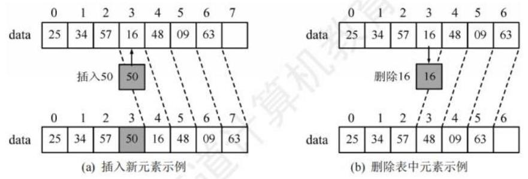

# 2.2 线性表的顺序表示

## 2.2.1 顺序表的定义

【命题追踪】 (算法题) 顺序表的应用 (2010、2011、2018、2020)

线性表的顺序存储又称顺序表。它是用一组地址连续的存储单元依次存储线性表中的数据元素, 从而使得逻辑上相邻的两个元素在物理位置上也相邻。第 1 个元素存储在顺序表的起始位置, 第 $i$ 个元素的存储位置后面紧接着存储的是第 $i + 1$ 个元素,称 $i$ 为元素 ${a}_{i}$ 在顺序表中的位序。因此, 顺序表的特点是表中元素的逻辑顺序与其存储的物理顺序相同。

假设顺序表 L 存储的起始位置为 LOC (A), `sizeof(ElemType)` 是每个数据元素所占用存储空间的大小, 则表 L 所对应的顺序存储如图 2.1 所示。


图 2.1 线性表的顺序存储结构

每个数据元素的存储位置都和顺序表的起始位置相差一个和该数据元素的位序成正比的常数, 因此, 顺序表中的任意一个数据元素都可以随机存取, 所以线性表的顺序存储结构是一种随机存取的存储结构。通常用高级程序设计语言中的数组来描述线性表的顺序存储结构。

> 注 意
>
> 线性表中元素的位序是从 1 开始的, 而数组中元素的下标是从 0 开始的。

假定线性表的元素类型为 `ElemType`, 则静态分配的顺序表存储结构描述为

```c
//定义线性表的最大长度
#define MaxSize 50

typedef struct{
    //顺序表的元素
    ElemType data[MaxSize];
    //顺序表的当前长度
    int length;
}SqList; //顺序表的类型定义
```

一维数组可以是 **静态分配** 的, 也可以是 **动态分配** 的。对数组进行静态分配时, 因为数组的大小和空间事先已经固定, 所以一旦空间占满, 再加入新数据就会产生溢出, 进而导致程序崩溃。

而在动态分配时, 存储数组的空间是在程序执行过程中通过动态存储分配语句分配的, 一旦数据空间占满, 就另外开辟一块更大的存储空间, 将原表中的元素全部拷贝到新空间, 从而达到扩充数组存储空间的目的, 而不需要为线性表一次性地划分所有空间。

动态分配的顺序表存储结构描述为

```c
#define InitSize 100 //表长度的初始定义

typedef struct{
    ElemType *data; //指示动态分配数组的指针
    int MaxSize, length; //数组的最大容量和当前个数
}SeqList; //动态分配数组顺序表的类型定义
```

C 的初始动态分配语句为

```c
L.data = (ElemType*)malloc(sizeof(ElemTyle) * InitSize)
```

C++ 的初始动态分配语句为

```c++
L.data=new ElemType[InitSize];
```

> 注 意
>
> 动态分配并不是链式存储, 它同样属于顺序存储结构, 物理结构没有变化, 依然是随机存取方式, 只是分配的空间大小可以在运行时动态决定。

顺序表的主要优点:  
①可进行随机访问,即可通过首地址和元素序号可以在 $O\left( 1\right)$ 时间内找到指定的元素;  
②存储密度高, 每个结点只存储数据元素。

顺序表的缺点也很明显:  
①元素的插入和删除需要移动大量的元素,插入操作平均需要移动 $n/2$ 个元素,删除操作平均需要移动 $\left( {n - 1}\right) /2$ 个元素；  
②顺序存储分配需要一段连续的存储空间，不够灵活。

## 2.2.2 顺序表上基本操作的实现

【命题追踪】 顺序表上操作的时间复杂度分析（2023）

这里仅讨论顺序表的初始化、插入、删除和按值查找, 其他基本操作的算法都很简单。

> 注 意
>
> 在各种操作的实现中 (包括严蔚敏老师撰写的教材), 往往可以忽略边界条件判断、变量定义、内存分配不足等细节, 即不要求代码具有可执行性, 而重点在于算法的思想。

### 1. 顺序表的初始化

静态分配和动态分配的顺序表的初始化操作是不同的。静态分配在声明一个顺序表时, 就已为其分配了数组空间, 因此初始化时只需将顺序表的当前长度设为 0 。

```c++
// SqList L; //声明一个顺序表

void InitList(SqList &L) {
    L.length = 0; //顺序表初始长度为 0
}
```

动态分配的初始化为顺序表分配一个预定义大小的数组空间, 并将顺序表的当前长度设为 0 。 MaxSize 指示顺序表当前分配的存储空间大小, 一旦因插入元素而空间不足, 就进行再分配。

```c++
void InitList(SeqList &L){
    L.data=(ElemType *)malloc(MaxSize*sizeof(ElemType)); //分配存储空间
    L.length=0; //顺序表初始长度为 0
    L.MaxSize=InitSize; //初始存储容量
}
```

### 2. 插入操作

在顺序表 L 的第 i ( `1<=i<=L.length+1` ) 个位置插入新元素 e 。若 i 的输入不合法,则返回 false, 表示插入失败; 否则, 将第 i 个元素及其后的所有元素依次往后移动一个位置, 腾出一个空位置插入新元素 e ,顺序表长度增加 1,插入成功,返回 true。

```c++
bool ListInsert(SqList &L, int i, ElemType e) {
    if (i<1 || i>L.length+1) { // 判断 i 的范围是否有效
        return false;
    }

    if (L.length>=MaxSize) { // 当前存储空间已满, 不能插入
        return false;
    }

    for(int j = L.length; j>=i; j--) { // 将第 i 个元素及之后的元素后移
        L.data[j] = L.data[j-1];
    }

    L.data[i-1] = e; // 在位置 i 处放入 e $
    L.length++; // 线性表长度加 1
    return true;
}
```

> 注意
>
> 区别顺序表的位序和数组下标。为何判断插入位置是否合法时 if 语句中用 length+1 , 而移动元素的 for 语句中只用 length。

最好情况: 在表尾插入 (即 $i = n + 1$ ),元素后移语句将不执行,时间复杂度为 $O\left( 1\right)$ 。

最坏情况: 在表头插入 (即 $i = 1$ ),元素后移语句将执行 $n$ 次,时间复杂度为 $O\left( n\right)$ 。

平均情况: 假设 ${p}_{i}\left( {{p}_{i} = 1/\left( {n + 1}\right) }\right)$ 是在第 $i$ 个位置上插入一个结点的概率,则在长度为 $n$ 的线性表中插入一个结点时, 所需移动结点的平均次数为

$$
\mathop{\sum }\limits_{{i = 1}}^{{n + 1}}{p}_{i}\left( {n - i + 1}\right) = \mathop{\sum }\limits_{{i = 1}}^{{n + 1}}\frac{1}{n + 1}\left( {n - i + 1}\right) = \frac{1}{n + 1}\mathop{\sum }\limits_{{i = 1}}^{{n + 1}}\left( {n - i + 1}\right) = \frac{1}{n + 1}\frac{n\left( {n + 1}\right) }{2} = \frac{n}{2}
$$

因此,顺序表插入算法的平均时间复杂度为 $O\left( n\right)$ 。

### 3. 删除操作

删除顺序表 L 中第 i ( `1<=i<=L.length+1` ) 个位置的元素,用引用变量 e 返回。若 i 的输入不合法,则返回 false; 否则,将被删元素赋给引用变量 e ,并将第 i+1 个元素及其后的所有元素依次往前移动一个位置, 返回 true。

```c++
bool ListDelete(SqList &L, int i, ElemType &e) {
    if (i<1 || i>L.length) { // 判断 i 的范围是否有效
        return false;
    }
    e = L.data[i-1]; // 将被删除的元素赋值给e
    for(int j=i; j<L.length; j++) { // 将第 i 个位置后的元素前移
        L.data[j-1] = L.data[j];
    }
    L.length--; // 线性表长度减 1
    return true;
}
```

最好情况: 删除表尾元素 (即 $i = n$ ),无须移动元素,时间复杂度为 $O\left( 1\right)$ 。

最坏情况: 删除表头元素 (即 $i = 1$ ),需移动除表头元素外的所有元素,时间复杂度为 $O\left( n\right)$ 。

平均情况: 假设 ${p}_{i}\left( {{p}_{i} = 1/n}\right)$ 是删除第 $i$ 个位置上结点的概率,则在长度为 $n$ 的线性表中删除一个结点时, 所需移动结点的平均次数为

$$
\mathop{\sum }\limits_{{i = 1}}^{n}{p}_{i}\left( {n - i}\right) = \mathop{\sum }\limits_{{i = 1}}^{n}\frac{1}{n}\left( {n - i}\right) = \frac{1}{n}\mathop{\sum }\limits_{{i = 1}}^{n}\left( {n - i}\right) = \frac{1}{n}\frac{n\left( {n - 1}\right) }{2} = \frac{n - 1}{2}
$$

因此,顺序表删除算法的平均时间复杂度为 $O\left( n\right)$ 。

可见, 顺序表中插入和删除操作的时间主要耗费在移动元素上, 而移动元素的个数取决于插入和删除元素的位置。图 2.2 所示为一个顺序表在进行插入和删除操作前、后的状态, 以及其数据元素在存储空间中的位置变化和表长变化。在图 2.2(a)中,将第 4 个至第 7 个元素从后往前依次后移一个位置, 在图 2.2(b)中, 将第 5 个至第 7 个元素从前往后依次前移一个位置。



图 2.2 顺序表的插入和删除

### 4. 按值查找 (顺序查找)

在顺序表 L 中查找第一个元素值等于 e 的元素,并返回其位序。

```c++
int LocateElem(SqList L, ElemType e) {
    for(int i = 0; i<L.length; i++) {
        if(L.data[i] == e) {
            return i+1; //下标为 i 的元素值等于 e ,返回其位序 i+1
        }
    }
    return 0; //退出循环, 说明查找失败
}
```

最好情况: 查找的元素就在表头,仅需比较一次,时间复杂度为 $O\left( 1\right)$ 。

最坏情况: 查找的元素在表尾 (或不存在) 时,需要比较 $n$ 次,时间复杂度为 $O\left( n\right)$ 。

平均情况: 假设 ${p}_{i}\left( {{p}_{i} = 1/n}\right)$ 是查找的元素在第 i ( `1<=i<=L.length+1` ) 个位置上的概率, 则在长度为 $n$ 的线性表中查找值为 $\mathrm{e}$ 的元素所需比较的平均次数为

$$
\mathop{\sum }\limits_{{i = 1}}^{n}{p}_{i} \cdot i = \mathop{\sum }\limits_{{i = 1}}^{n}\frac{1}{n} \cdot i = \frac{1}{n}\frac{n\left( {n + 1}\right) }{2} = \frac{n + 1}{2}
$$

因此,顺序表按值查找算法的平均时间复杂度为 $O\left( n\right)$ 。

顺序表的按序号查找非常简单,即直接根据数组下标访问数组元素,其时间复杂度为 $O\left( 1\right)$ 。

## 2.2.3 本节试题精选

**13**. 若长度为 n 的非空线性表采用顺序存储结构,在表的第 i 个位置插入一个数据元素,则 i 的合法值应该是 ( )。

A. 1≤i≤n &emsp; B. 1≤i≤n+1 &emsp; C. 0≤i≤n-1 &emsp; D. 0≤i≤n

## 2.2.4 答案与解析

**13**. B  
线性表元素的序号是从 1 开始,而在第 n+1 个位置插入相当于在表尾追加。
