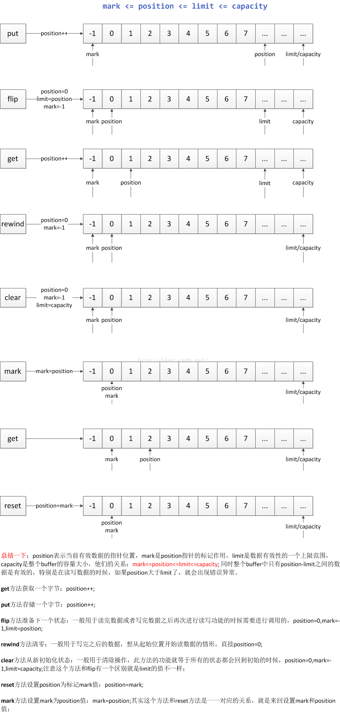

# ByteBuffer

这里指 `java.nio.ByteBuffer`。Buffer提供了一个字节缓冲区，其可以不断的从Channel中读取接收到的数据。Buffer的优点主要在于其提供了一系列的Api，能够让用户更方便的对数据进行读取和写入。  

## 子类

| 子类 | 描述 | 优点 |
| --- | --- | --- |
| HeapByteBuffer | 在jvm堆上面的一个buffer，底层的本质是一个数组 | 由于内容维护在jvm里，所以把内容写进buffer里速度会快些；并且，可以更容易回收 |
| DirectByteBuffer | 底层的数据其实是维护在操作系统的内存中，而不是jvm里，DirectByteBuffer里维护了一个引用address指向了数据，从而操作数据 | 跟外设（IO设备）打交道时会快很多，因为外设读取jvm堆里的数据时，不是直接读取的，而是把jvm里的数据读到一个内存块里，再在这个块里读取的，如果使用DirectByteBuffer，则可以省去这一步，实现zero copy |

## 属性

- `mark` ：记录了当前所标记的索引下标；

- `position` ：对于写入模式，表示当前可写入数据的下标，对于读取模式，表示接下来可以读取的数据的下标；

- `limit` ：对于写入模式，表示当前可以写入的数组大小，默认为数组的最大长度，对于读取模式，表示当前最多可以读取的数据的位置下标；

- `capacity` ：表示当前数组的容量大小；

- `array` ：保存了当前写入的数据。

它们总是满足
mark <= position <= limit <= capacity

初始状态为position=0，limit=capacity=分配的大小

## 方法

常规方法：

```java
//创建一个指定capacity的ByteBuffer。
ByteBuffer allocate(int capacity) 
//创建一个direct的ByteBuffer，这样的ByteBuffer在参与IO操作时性能会更好
ByteBuffer allocateDirect(int capacity) 
//把一个byte数组或byte数组的一部分包装成ByteBuffer。
ByteBuffer wrap(byte [] array)
ByteBuffer wrap(byte [] array, int offset, int length) 
//get put方法不多说
byte get(int index)
ByteBuffer put(byte b)
//从ByteBuffer中读出一个int值。
int getInt()
// 写入一个int值到ByteBuffer中。
ByteBuffer putInt(int value)
```

特殊方法：

```java
// 把position设为0，把limit设为capacity，一般在把数据写入Buffer前调用。
Buffer clear()
// 把limit设为当前position，把position设为0，一般在从Buffer读出数据前调用。
Buffer flip()
// 把position设为0，limit不变，一般在把数据重写入Buffer前调用。
Buffer rewind()
// 将 position 与 limit之间的数据复制到buffer的开始位置，复制后 position = limit -position,limit = capacity, 但如果position 与limit 之间没有数据的话发，就不会进行复制。
compact()
// 通过调用Buffer.mark()方法，可以标记Buffer中的一个特定position。之后可以通过调用Buffer.reset()方法恢复到这个position。
mark() & reset()     
```

## 图解


