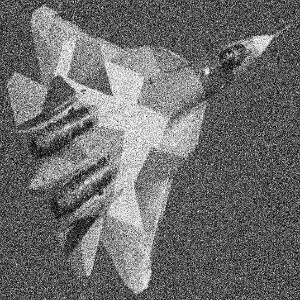
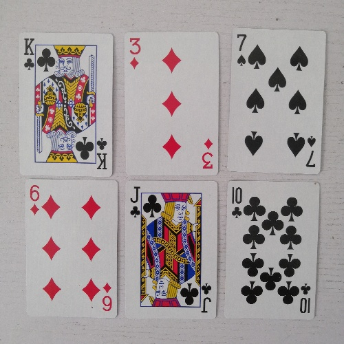

# OpenCV

OpenCV java/kotlin

## 安装

进入[OpenCV Release](https://opencv.org/releases/)，选择Windows，等待下载完成后解压到合适的文件夹。  
打开项目的build.gradle.kts文件，在`dependices`里添加

```kotlin
// OpenCV
implementation(files("""【这里替换成OpenCV的根目录】\build]\java\opencv-490.jar"""))
```

同步一下Gradle即可

使用到的图片预览






## Hello World

在使用OpenCV前先要加载动态链接库 `System.load("""【这里替换成OpenCV的根目录】\build\java\x64\opencv_java490.dll""")`

```kotlin
import org.opencv.core.Core
import org.opencv.highgui.HighGui.imshow
import org.opencv.highgui.HighGui.waitKey
import org.opencv.imgcodecs.Imgcodecs.imread

fun main() {
    // 加载OpenCV动态链接库
    System.load("""E:\softwares\opencv\build\java\x64\opencv_java490.dll""")
    // 打印OpenCV版本
    println(Core.getVersionString())
    // 读取图片
    val image = imread("./src/main/kotlin/OpenCV/opencv_logo.jpg")
    // 打印图片信息（宽高，通道数等）
    println(image)
    // 显示图片
    imshow("窗口标题", image)
    // 等待键盘输入，防止闪一下图片就退出
    waitKey()
}
```

## 颜色 color

对于OpenCV来说，一张彩色图等于三张灰度图。颜色顺序为BGR  
灰度图：明暗程度（可以说是相机CMOS上光子数量的分布图）

```kotlin
import org.opencv.core.Core
import org.opencv.core.Mat
import org.opencv.highgui.HighGui.imshow
import org.opencv.highgui.HighGui.waitKey
import org.opencv.imgcodecs.Imgcodecs
import org.opencv.imgcodecs.Imgcodecs.imread
import org.opencv.imgproc.Imgproc

fun main() {
    // 加载OpenCV动态链接库
    System.load("""E:\softwares\opencv\build\java\x64\opencv_java490.dll""")
    val image = imread("./src/main/kotlin/OpenCV/opencv_logo.jpg")
    imshow("蓝", image.blue())
    imshow("绿", image.green())
    imshow("红", image.red())
    imshow("灰", image.gray())
    waitKey()
}

// 对于OpenCV来说，一张彩色图等于三张灰度图。颜色顺序为BGR
// 提取指定通道
fun Mat.getChannel(channel: Int): Mat {
    val mat = Mat()
    Core.extractChannel(this, mat, channel)
    return mat
}

// 提取蓝色通道，对应Python的image[:,:,0]
fun Mat.blue(): Mat {
    return getChannel(0)
}

// 提取绿色通道，对应Python的image[:,:,1]
fun Mat.green(): Mat {
    return getChannel(1)
}

// 提取红色通道，对应Python的image[:,:,2]
fun Mat.red(): Mat {
    return getChannel(2)
}

// 获取灰度图
fun Mat.gray(): Mat {
    val mat = Mat()
    Imgproc.cvtColor(this, mat, Imgproc.COLOR_BGR2GRAY)
    return mat
}

// 获取灰度图
fun gray(path: String): Mat = imread(path, Imgcodecs.IMREAD_GRAYSCALE)
```

## 切割 crop

```kotlin
import org.opencv.highgui.HighGui.imshow
import org.opencv.highgui.HighGui.waitKey
import org.opencv.imgcodecs.Imgcodecs.imread

fun main() {
    System.load("""E:\softwares\opencv\build\java\x64\opencv_java490.dll""")
    val image = imread("./src/main/kotlin/OpenCV/opencv_logo.jpg")
    // 切割图片 public Mat submat(int rowStart, int rowEnd, int colStart, int colEnd)
    val cropped = image.submat(10, 170, 40, 200)
    imshow("cropped", cropped)
    waitKey()
}
```

## 绘制 draw

```kotlin
import org.opencv.core.CvType
import org.opencv.core.Mat
import org.opencv.core.Point
import org.opencv.core.Scalar
import org.opencv.highgui.HighGui.imshow
import org.opencv.highgui.HighGui.waitKey
import org.opencv.imgproc.Imgproc

fun main() {
    System.load("""E:\softwares\opencv\build\java\x64\opencv_java490.dll""")
    // Scalar是OpenCV中用于表示颜色的结构体。1个参数表示灰度值，3个参数表示RGB，4个参数表示RGBA
    // 创建一个300*300的Mat，通道数为3，每个通道8位，初始化值为0
    val image = Mat(300, 300, CvType.CV_8UC3, Scalar(0.0))
    val blue = Scalar(255.0, 0.0, 0.0)
    val green = Scalar(0.0, 255.0, 0.0)
    val red = Scalar(0.0, 0.0, 255.0)
    val white = Scalar(255.0, 255.0, 255.0)
    // 画线，参数为图像，起点，终点，颜色，线宽
    Imgproc.line(image, Point(100.0, 200.0), Point(250.0, 250.0), blue, 2)
    // 画矩形，参数为图像，左上角，右下角，颜色，线宽
    Imgproc.rectangle(image, Point(30.0, 100.0), Point(60.0, 150.0), green, 2)
    // 画圆，参数为图像，圆心，半径，颜色，线宽
    Imgproc.circle(image, Point(150.0, 100.0), 20, red, 3)
    // 画文字，参数为图像，文字，起点，字体，字体大小，颜色，线宽，线条类型
    Imgproc.putText(image, "hello", Point(100.0, 50.0), Imgproc.FONT_HERSHEY_SIMPLEX, 1.0, white, 2, Imgproc.LINE_AA)
    imshow("画图", image)
    waitKey()
}
```

## 模糊 blur

```kotlin
import org.opencv.core.Mat
import org.opencv.core.Size
import org.opencv.highgui.HighGui.imshow
import org.opencv.highgui.HighGui.waitKey
import org.opencv.imgcodecs.Imgcodecs.imread
import org.opencv.imgproc.Imgproc

fun main() {
    System.load("""E:\softwares\opencv\build\java\x64\opencv_java490.dll""")
    val source = imread("./src/main/kotlin/OpenCV/plane.jpg")

    val gauss = Mat()
    // 高斯模糊，参数：原图，目标图，核大小，标准差
    Imgproc.GaussianBlur(source, gauss, Size(5.0, 5.0), 0.0)

    // 中值模糊
    val median = Mat()
    // 参数：原图，目标图，核大小
    Imgproc.medianBlur(source, median, 5)

    imshow("原图", source)
    imshow("高斯滤波", gauss)
    imshow("中值滤波", median)
    waitKey()
}
```

## 特征点 corner

```kotlin
import org.opencv.core.MatOfPoint
import org.opencv.core.Point
import org.opencv.core.Scalar
import org.opencv.highgui.HighGui.imshow
import org.opencv.highgui.HighGui.waitKey
import org.opencv.imgcodecs.Imgcodecs.imread
import org.opencv.imgproc.Imgproc

fun main() {
    System.load("""E:\softwares\opencv\build\java\x64\opencv_java490.dll""")
    val image = imread("./src/main/kotlin/OpenCV/opencv_logo.jpg")
    // 灰度图
    val gray = image.gray()
    
    // 检测特征点
    val corners = MatOfPoint()
    // 参数：原图，特征点，最大特征点数，最小特征点质量，特征点之间的最小距离
    Imgproc.goodFeaturesToTrack(gray, corners, 500, 0.1, 10.0)

    // 绘制特征点
    for (corner in corners.toArray()) {
        Imgproc.circle(image, Point(corner.x, corner.y), 3, Scalar(255.0, 0.0, 255.0), -1)
    }

    // 显示图像
    imshow("corners", image)
    waitKey()
}
```

## 匹配模板 match

TM_CCOEFF_NORMED是标准相关匹配算法：把待检测图像和模板都标准化，再计算匹配度，保证匹配结果不收光照强度的影响，匹配越接近1，说明匹配越准确

```kotlin
import org.opencv.core.Mat
import org.opencv.core.Point
import org.opencv.core.Scalar
import org.opencv.highgui.HighGui.imshow
import org.opencv.highgui.HighGui.waitKey
import org.opencv.imgcodecs.Imgcodecs.imread
import org.opencv.imgproc.Imgproc

fun main() {
    System.load("""E:\softwares\opencv\build\java\x64\opencv_java490.dll""")
    val image = imread("./src/main/kotlin/OpenCV/poker.jpg")
    val gray = image.gray()
    val template = gray.submat(75, 105, 235, 265)

    // 设置阈值
    val threshold = 0.9

    // 模板宽高
    val templateWidth = template.cols()
    val templateHeight = template.rows()

    // 匹配模板
    val points = gray.match(template, threshold)

    // 绘制矩形
    for (p in points) {
        Imgproc.rectangle(image, p, Point(p.x + templateWidth, p.y + templateHeight), Scalar(0.0, 255.0, 0.0), 2)
    }

    // 显示
    imshow("image", image)
    waitKey()
}

// 匹配模板，返回匹配的点坐标（左上角）
fun Mat.match(template: Mat, threshold: Double, method: Int = Imgproc.TM_CCOEFF_NORMED): List<Point> {
    val result = Mat()
    // 匹配模板。参数：原图，模板图，目标图，匹配模式
    // TM_CCOEFF_NORMED是标准相关匹配算法：把待检测图像和模板都标准化，再计算匹配度，保证匹配结果不收光照强度的影响，匹配越接近1，说明匹配越准确
    Imgproc.matchTemplate(this, template, result, method)
    return buildList {
        for (y in 0..<result.rows()) {
            for (x in 0..<result.cols()) {
                // 在 matchTemplate 函数中，result 矩阵包含模板匹配的结果。每个位置的值表示模板在该位置的匹配度。值越高，匹配度越高。
                //由于 result.get(y, x) 返回一个数组（包含匹配度值），所以我们需要使用 [0] 来访问数组中的第一个元素，该元素即为匹配度值。
                if (result.get(y, x)[0] >= threshold) {
                    add(Point(x.toDouble(), y.toDouble()))
                }
            }
        }
    }
}
```

## 梯度 gradient

```kotlin
import org.opencv.core.Core
import org.opencv.core.CvType
import org.opencv.core.Mat
import org.opencv.highgui.HighGui.imshow
import org.opencv.highgui.HighGui.waitKey
import org.opencv.imgcodecs.Imgcodecs.imread
import org.opencv.imgproc.Imgproc

fun main() {
    System.load("""E:\softwares\opencv\build\java\x64\opencv_java490.dll""")
    val image = imread("./src/main/kotlin/OpenCV/opencv_logo.jpg").gray()
    val laplacian = Mat()
    // 拉普拉斯算子，大致对应图象的二阶导数
    Imgproc.Laplacian(image, laplacian, CvType.CV_64F)

    val laplacian8U = Mat()
    // HighGui.imshow()无法显示64位浮点数，需要转换为8位整型
    Core.convertScaleAbs(laplacian, laplacian8U)

    val canny = Mat()
    // 边缘检测
    Imgproc.Canny(image, canny, 100.0, 200.0)

    imshow("laplacian", laplacian8U)
    imshow("canny", canny)
    imshow("image", image)
    waitKey()
}
```

## 阈值 threshold

阈值也即二值化

```kotlin
import org.opencv.core.Mat
import org.opencv.highgui.HighGui.imshow
import org.opencv.highgui.HighGui.waitKey
import org.opencv.imgproc.Imgproc

fun main() {
    System.load("""E:\softwares\opencv\build\java\x64\opencv_java490.dll""")
    val gray = gray("./src/main/kotlin/OpenCV/bookpage.jpg")
    
    val dest = Mat()
    // 阈值（二值化），参数：原图，目标图，阈值，最大值，二值化模式
    Imgproc.threshold(gray, dest, 10.0, 255.0, Imgproc.THRESH_BINARY)
    
    val adaptive = Mat()
    // 自适应阈值，参数：原图，目标图，最大值，二值化模式，自适应模式，自适应窗口大小，自适应常数
    Imgproc.adaptiveThreshold(gray, adaptive, 255.0, Imgproc.ADAPTIVE_THRESH_GAUSSIAN_C, Imgproc.THRESH_BINARY, 115, 1.0)
    
    val otsu = Mat()
    // OTSU阈值，参数：原图，目标图，阈值，最大值，二值化模式
    Imgproc.threshold(gray, otsu, 0.0, 255.0, Imgproc.THRESH_BINARY + Imgproc.THRESH_OTSU)
    
    imshow("dest", dest)
    imshow("adaptive", adaptive)
    imshow("otsu", otsu)
    waitKey()
}
```

## 形态学 morphology

```kotlin
import org.opencv.core.CvType
import org.opencv.core.Mat
import org.opencv.core.Size
import org.opencv.highgui.HighGui.imshow
import org.opencv.highgui.HighGui.waitKey
import org.opencv.imgproc.Imgproc

fun main() {
    System.load("""E:\softwares\opencv\build\java\x64\opencv_java490.dll""")
    val image = gray("./src/main/kotlin/OpenCV/opencv_logo.jpg")
    
    // 阈值/二值化
    val threshold = Mat()
    Imgproc.threshold(image, threshold, 200.0, 255.0, Imgproc.THRESH_BINARY_INV)

    // 创建一个5*5的核
    val kernel = Mat.ones(Size(5.0, 5.0), CvType.CV_8U)

    // 腐蚀
    val erosion = Mat()
    Imgproc.erode(threshold, erosion, kernel)

    // 膨胀
    val dilation = Mat()
    Imgproc.dilate(threshold, dilation, kernel)

    imshow("dest", threshold)
    imshow("erosion", erosion)
    imshow("dilation", dilation)
    waitKey()
}
```
