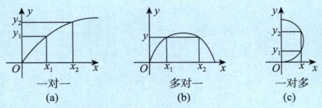
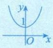
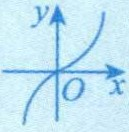

# 1.1 函数的概念与特性

## 1. 函数

设 $x$ 与 $y$ 是两个变量，$D$ 是一个给定的数集，若对于每一个 $x\in D$ ，按照一定的法则 $f$，有一个确定的值 $y$ 与之对应，则称 $y$ 为 $x$ 的 **函数** ，记作 $y=f(x)$ 。称 $x$ 为 **自变量** ， $y$ 为 **因变量** 。称数集 $D$ 为此函数的 **定义域** ，定义域一般由实际背景中变量的具体意义或者函数对应法则的要求确定。称 $\{ f\left( x\right) \mid x \in D\}$ 为值域.

> 【注】单值函数与多值函数.
>
> 事实上,上述定义的函数是单值函数,若给一个 ${x}_{1}$ ,对应一个 ${y}_{1}$ ; 给另外一个 ${x}_{2}$ ,对应另外一个 ${y}_{2}$ ,这叫一对一 [见图 1-1(a)]. 若给定 ${x}_{1},{x}_{2}\left( {{x}_{1} \neq {x}_{2}}\right)$ ,它们对应同一个 $y$ ,则称多对一 [见图 1-1(b)], 所以函数可以一对一, 也可以多对一, 这叫单值函数.
>
> 但是,若一个 $x$ 对应一个 ${y}_{1}$ ,又对应另一个 ${y}_{2}$ ,也就是一对多,这叫多值函数 [见图 1-1(c)], 它不在上述定义中.
>
> 
>
> 图 1-1
>
> 我们的研究对象主要是单值函数.

【例 1.1】 设 $f\left( {x + \displaystyle\frac{1}{x}}\right) = \displaystyle\frac{x + {x}^{3}}{1 + {x}^{4}}, x \geq 2$ ,则 $f\left( x\right) = $ ______

解 应填 $\displaystyle\displaystyle\frac{x}{{x}^{2} - 2}$ .

$f\left( {x + \displaystyle\frac{1}{x}}\right) = \displaystyle\frac{x + {x}^{3}}{1 + {x}^{4}} = \displaystyle\frac{x + \displaystyle\frac{1}{x}}{{x}^{2} + \displaystyle\frac{1}{{x}^{2}}} = \displaystyle\frac{x + \displaystyle\frac{1}{x}}{{\left( x + \displaystyle\frac{1}{x}\right) }^{2} - 2}$ ,于是 $f\left( x\right) = \displaystyle\frac{x}{{x}^{2} - 2}$ .

【例 1.2】 设函数 $f\left( x\right)$ 的定义域为 $\left( {0, + \infty }\right)$ ,且满足 ${2f}\left( x\right) + {x}^{2}f\left( \displaystyle\frac{1}{x}\right) = \displaystyle\frac{{x}^{2} + {2x}}{\sqrt{1 + {x}^{2}}}$ ,则 $f\left( x\right) =$ ______

解 应填 $\displaystyle\frac{x}{\sqrt{1 + {x}^{2}}}$ .

由 ${2f}\left( x\right) + {x}^{2}f\left( \displaystyle\frac{1}{x}\right) = \displaystyle\frac{{x}^{2} + {2x}}{\sqrt{1 + {x}^{2}}}$ ,得 ${2f}\left( \displaystyle\frac{1}{x}\right) + \displaystyle\frac{1}{{x}^{2}}f\left( x\right) = \displaystyle\frac{\displaystyle\frac{1}{{x}^{2}} + \displaystyle\frac{2}{x}}{\sqrt{1 + \displaystyle\frac{1}{{x}^{2}}}} = \displaystyle\frac{\displaystyle\frac{1 + {2x}}{{x}^{2}}}{\displaystyle\frac{\sqrt{1 + {x}^{2}}}{x}} = \displaystyle\frac{1 + {2x}}{x\sqrt{1 + {x}^{2}}}$ ,结合以上两式, 消去 $f\left( \displaystyle\frac{1}{x}\right)$ ,可得 $f\left( x\right) = \displaystyle\frac{x}{\sqrt{1 + {x}^{2}}}$ .

> 【注】若给 $f\left( x\right) + {xf}\left( {-x}\right) = x$ ,应学会写 $f\left( {-x}\right) - {xf}\left( x\right) = - x$ ,消去 $f\left( {-x}\right)$ ,得 $f\left( x\right) = \displaystyle\frac{x + {x}^{2}}{1 + {x}^{2}}$ .

## 2.反函数

设函数 $y=f(x)$ 的定义域为 $D$ ，值域为 $R$ 。如果对于每一个 $y \in R$ ，必存在唯一的 $x \in D$ 使得 $y=f(x)$ 成立，则由此定义了一个新的函数 $x=\varphi(y)$ 。这个函数就称为函数 $y=f(x)$ 的反函数，一般记作 $x=f^{-1}(y)$ ，它的定义域为 $R$ ，值域为 $D$ ，相对于反函数来说，原来的函数也称为 **直接函数** 。以下两点需要说明。

第一，严格单调函数必有反函数，比如函数 $y=x^2 (x\in [0, +\infty))$ 是严格单调函数，故它有反函数 $x=\sqrt{y}$ 。

第二，若把 $x=f^{-1}(y)$ 与 $y=f(x)$ 的图形画在同一坐标系中，则它们完全重合。只有把 $y=f(x)$ 的反函数 $x=f^{-1}(y)$ 写成 $y=f^{-1}(x)$ 后，它们的图形才关于 $y=x$ 对称，事实上这也是字母 $x$ 与 $y$ 互换的结果。

> 【注】有反函数的函数不一定是单调函数。比如 $f(x)=\begin{cases}x,\quad x\geq 0,\\[10px] \displaystyle\frac{1}{x}, \quad x<0,\end{cases}$ ，其图像如图 1-2 所示，其反函数即为 $f(x)$ 本身，但 $f(x)$ 不是单调函数。  
>   
> 图 1-2

【例 1.3】 求函数 $y = f\left( x\right) = \ln \left( {x + \sqrt{{x}^{2} + 1}}\right)$ 的反函数 ${f}^{-1}\left( x\right)$ 的表达式及其定义域.

解 直接由 $y = \ln \left( {x + \sqrt{{x}^{2} + 1}}\right)$ 解出 $x = {f}^{-1}\left( y\right)$ 会很麻烦,现采用下述方法.

$$
- y = - \ln \left( {x + \sqrt{{x}^{2} + 1}}\right) = \ln \frac{1}{x + \sqrt{{x}^{2} + 1}}
$$

$$
= \ln \frac{\sqrt{{x}^{2} + 1} - x}{\left( {\sqrt{{x}^{2} + 1} + x}\right) \left( {\sqrt{{x}^{2} + 1} - x}\right) } = \ln \left( {\sqrt{{x}^{2} + 1} - x}\right) ,
$$

所以

$$
\begin{align}
\text{公式: } & \mathrm{e}^{-y} = \sqrt{{x}^{2} + 1} - x, \tag*{$①$}
\end{align}
$$

再由 $y = f\left( x\right)$ 的表达式有

$$
{\mathrm{e}}^{y} = \sqrt{{x}^{2} + 1} + x, \tag*{$②$}
$$

② - ①, 得

$$
x = \frac{1}{2}\left( {{\mathrm{e}}^{y} - {\mathrm{e}}^{-y}}\right) ,
$$

交换上式中 $x, y$ 的位置后就是 $y = f\left( x\right)$ 的反函数,即

$$
y = {f}^{-1}\left( x\right) = \frac{1}{2}\left( {{\mathrm{e}}^{x} - {\mathrm{e}}^{-x}}\right) , - \infty < x < + \infty .
$$

> 【注】(1) 函数 $y = \ln \left( {x + \sqrt{{x}^{2} + 1}}\right)$ 叫作反双曲正弦函数,其图像如图 1-3(a) 所示. 函数 $y = \displaystyle\frac{{\mathrm{e}}^{x} - {\mathrm{e}}^{-x}}{2}$ 叫作双曲正弦函数, 其图像如图 1-3(b) 所示. 考生应记住这两个函数的图像.
>
> 
>
> 图 1-3
>
> (2) $y = \displaystyle\frac{{\mathrm{e}}^{x} + {\mathrm{e}}^{-x}}{2}$ 叫作双曲余弦函数,其图像如图 1-4 所示,它是偶函数,是一种特殊的悬链线. 达. 芬奇在画《抱银貂的女子》时, 曾仔细思索过女子的脖子上戴的项链的形状是什么函数, 可惜他一生都未能明白, 在他去世后近 200 年后, 约翰·伯努利解决了这个问题. 那不是抛物线 $y = {x}^{2}$ ,而是悬链线 $y = \displaystyle\frac{a}{2}\left( {{\mathrm{e}}^{\frac{x}{a}} + {\mathrm{e}}^{-\frac{x}{a}}}\right)$ ,取 $a = 1$ ,便是此例.
>
> 
>
> 图 1-4
>
> (3) 以后会知道如下 3 个重要结论.
>
> ① $x \rightarrow 0$ 时, $\ln \left( {x + \sqrt{{x}^{2} + 1}}\right) \sim x$ .
>
> ② ${\left\lbrack \ln \left( x + \sqrt{{x}^{2} + 1}\right) \right\rbrack }^{\prime } = \displaystyle\frac{1}{\sqrt{{x}^{2} + 1}}$ ,于是 $\int \displaystyle\frac{1}{\sqrt{{x}^{2} + 1}}\mathrm{\;d}x = \ln \left( {x + \sqrt{{x}^{2} + 1}}\right) + C$ .
>
> ③ 由于 $y = \ln \left( {x + \sqrt{{x}^{2} + 1}}\right)$ 是奇函数,于是 ${\int }_{-1}^{1}\left\lbrack {\ln \left( {x + \sqrt{{x}^{2} + 1}}\right) + {x}^{2}}\right\rbrack \mathrm{d}x = {\int }_{-1}^{1}{x}^{2}\mathrm{\;d}x = \frac{2}{3}$ .

## 3. 复合函数

设函数 $y=f(u)$ 的定义域为 $D_1$ ，函数 $u=g(x)$ 在 $D$ 上有定义，且 $g(D) \subset D_1$ ，则由

$$
y = f\left\lbrack {g\left( x\right) }\right\rbrack \left( {x \in D}\right)
$$

确定的函数，称为由函数 $u = g\left( x\right)$ 和函数 $y = f\left( u\right)$ 构成的 **复合函数** ，它的定义域为 $D$ ， $u$ 称为中间变量，考生要掌握复合的方法.

【例 1.4】 设 $f\left( x\right) = {x}^{2}, f\left\lbrack {\varphi \left( x\right) }\right\rbrack = - {x}^{2} + {2x} + 3$ ,且 $\varphi \left( x\right) \geq 0$ ,求 $\varphi \left( x\right)$ 及其定义域与值域.

解 由题设条件知, $f\left\lbrack {\varphi \left( x\right) }\right\rbrack = {\varphi }^{2}\left( x\right) = - {x}^{2} + {2x} + 3$ ,于是 $\varphi \left( x\right) = \sqrt{-{x}^{2} + {2x} + 3}$ .

由 $- {x}^{2} + {2x} + 3 \geq 0$ ,即 $\left( {x - 3}\right) \left( {x + 1}\right) \leq 0$ ,知 $\varphi \left( x\right)$ 的定义域为 $\left\lbrack {-1,3}\right\rbrack$ .

又 $\sqrt{-{x}^{2} + {2x} + 3} = \sqrt{-{\left( x - 1\right) }^{2} + 4}$ ,当 $x = 1$ 时, $\varphi \left( 1\right) = 2$ 为最大值,显然 $\varphi \left( {-1}\right) = \varphi \left( 3\right) = 0$ 为最小值,故 $\varphi \left( x\right)$ 的值域为 $\left\lbrack {0,2}\right\rbrack$ .

【例 1.5】 设 $g\left( x\right) = \left\{ {\begin{array}{l} 2 - x, x \leq 0, \\ 2 + x, x > 0, \end{array}f\left( x\right) = \left\{ \begin{array}{ll} {x}^{2}, & x < 0, \\ - x - 1, & x \geq 0, \end{array}\right. }\right.$ 则 $g\left\lbrack {f\left( x\right) }\right\rbrack =$ _________________

f(x)的图像

解 应填 $\left\{ \begin{array}{ll} 3 + x, & x \geq 0, \\ 2 + {x}^{2}, & x < 0. \end{array}\right.$

先求出 $g\left\lbrack {f\left( x\right) }\right\rbrack$ 的表达式.

$$
g\left\lbrack {f\left( x\right) }\right\rbrack = \left\{ \begin{array}{l} 2 - f\left( x\right), f\left( x\right) \leq 0, \\ 2 + f\left( x\right), f\left( x\right) > 0, \end{array}\right.
$$

当 $f\left( x\right) \leq 0$ 时, $x \geq 0$ ,此时 $f\left( x\right) = - x - 1$ ; 当 $f\left( x\right) > 0$ 时, $x < 0$ ,此时 $f\left( x\right) = {x}^{2}$ .

综上,

$$
g\left\lbrack {f\left( x\right) }\right\rbrack = \left\{ {\begin{array}{ll} 2 - \left( {-x - 1}\right) , & x \geq 0, \\ 2 + {x}^{2}, & x < 0 \end{array} = \left\{ \begin{array}{ll} 3 + x, & x \geq 0, \\ 2 + {x}^{2}, & x < 0. \end{array}\right. }\right.
$$

## 4. 隐函数

设方程 $F\left( {x, y}\right) = 0$ ,若当 $x$ 取某区间内的任一值时,总有满足该方程的唯一的值 $y$ 存在,则称方程 $F\left( {x, y}\right) = 0$ 在上述区间内确定了一个隐函数 $y = y\left( x\right)$ .

如 $x + {y}^{3} - 1 = 0$ 就表示一个隐函数,且可显化为 $y = \sqrt[3]{1 - x}$ ; 再如 $\sin \left( {xy}\right) = \ln \displaystyle\frac{x + \mathrm{e}}{y} + 1$ 也表示一个隐函数, 但不易显化.

一般来说,由 $F\left( {x, y}\right) = 0$ 所确定的隐函数求 $y\left( {x}_{0}\right)$ ,若代入 ${x}_{0}$ 易求出 $y\left( {x}_{0}\right)$ ,则直接求之; 若不易求出 $y\left( {x}_{0}\right)$ ,则用观察法. 如:

①设函数 $y = y\left( x\right)$ 由方程 $\ln y - \displaystyle\frac{x}{y} + x = 0$ 确定,当 $x = 2$ 时, $y\left( 2\right) = 1$ .

> $\ln y - \displaystyle\frac{2}{y} + 2 = 0$ ,显然可看出, $y = 1$ 时成立

②设函数 $y = y\left( x\right)$ 由方程 $\ln y + {\mathrm{e}}^{y - 1} = \displaystyle\frac{x}{2}$ 确定,当 $x = 2$ 时, $y\left( 2\right) = 1$ .

> $\ln y + {\mathrm{e}}^{y - 1} = 1$ . 显然可 看出， $y = 1$ 时成立
>
> 【注】考研试题中常出现这种问题, 考生要重视.

## 5. 函数的四种特性

### (1) 有界性

设 $f\left( x\right)$ 的定义域为 $D$ ,数集 $I \subset D$ . 如果存在某个正数 $M$ ,使对任一 $x \in I$ ,有 $\left| {f\left( x\right) }\right| \leq M$ ,则称 $f\left( x\right)$ 在 $I$ 上有界; 如果这样的 $M$ 不存在,则称 $f\left( x\right)$ 在 $I$ 上无界.

> 【注】(1) 从几何上看,如果在给定的区间,函数 $y = f\left( x\right)$ 的图形能够被直线 $y = - M$ 和 $y = M$ “完全包起来”,则为有界; 从解析上说,如果找到某个正数 $M$ ,使得 $\left| {f\left( x\right) }\right| \leq M$ ,则为有界.
>
> (2) 有界还是无界的讨论首先需指明区间 $I$ ,不知区间,无法谈论有界性. 比如 $y = \displaystyle\frac{1}{x}$ 在 $\left( {2, + \infty }\right)$ 内有界,但在 $\left( {0,2}\right)$ 内无界.
>
> (3) 事实上,只要在区间 $I$ 上或其端点处存在点 ${x}_{0}$ ,使得 $\mathop{\lim }\limits_{{x \rightarrow {x}_{0}}}f\left( x\right)$ 的值为无穷大,则没有任何两条直线 $y = - M$ 和 $y = M$ 可以把 $I$ 上的 $f\left( x\right)$ “包起来”,这就叫无界. 考研中常出这样的题目,比如例 1.17.

【例 1.6】 证明函数 $f\left( x\right) = \displaystyle\frac{x}{1 + {x}^{2}}$ 在 $\left( {-\infty , + \infty }\right)$ 内有界.

证明 当 $x \neq 0$ 时,

$$
\;\left| {f\left( x\right) }\right| = \frac{\left| x\right| }{1 + {x}^{2}} = \frac{1}{\displaystyle\frac{1}{\left| x\right| } + \left| x\right| }
$$ ,

由不等式 $\displaystyle\frac{a + b}{2} \geq \sqrt{ab}\left( {a, b > 0}\right)$ ,有 $\displaystyle\frac{1}{\left| x\right| } + \left| x\right| \geq 2\sqrt{\frac{1}{\left| x\right| }\left| x\right| } = 2$ ,即 $\left| {f\left( x\right) }\right| \leq \displaystyle\frac{1}{2}$ .

当 $x = 0$ 时, $f\left( 0\right) = 0$ . 综上,函数 $f\left( x\right)$ 在 $\left( {-\infty , + \infty }\right)$ 内有界.

### (2) 单调性

设 $f\left( x\right)$ 的定义域为 $D$ ,区间 $I \subset D$ . 如果对于区间 $I$ 上任意两点 ${x}_{1},{x}_{2}$ ,当 ${x}_{1} < {x}_{2}$ 时,恒有 $f\left( {x}_{1}\right) < f\left( {x}_{2}\right)$ , 则称 $f\left( x\right)$ 在区间 $I$ 上单调增加. 如果对于区间 $I$ 上任意两点 ${x}_{1},{x}_{2}$ ,当 ${x}_{1} < {x}_{2}$ 时,恒有 $f\left( {x}_{1}\right) >$ $f\left( {x}_{2}\right)$ ,则称 $f\left( x\right)$ 在区间 $I$ 上单调减少.

> 【注】后面会看到, 在考研试题中常常用求导的方法来讨论函数在某个区间上的单调性, 但是定义法不可以忘记. 试题中也常用到如下定义法的判别形式, 请读者留意.
>
> 对任意 ${x}_{1},{x}_{2} \in D,{x}_{1} \neq {x}_{2}$ ,有
>
> $f\left( x\right)$ 是单调增函数 $\Leftrightarrow \left( {{x}_{1} - {x}_{2}}\right) \left\lbrack {f\left( {x}_{1}\right) - f\left( {x}_{2}\right) }\right\rbrack > 0$ ;
>
> $f\left( x\right)$ 是单调减函数 $\Leftrightarrow \left( {{x}_{1} - {x}_{2}}\right) \left\lbrack {f\left( {x}_{1}\right) - f\left( {x}_{2}\right) }\right\rbrack < 0$ ;
>
> $f\left( x\right)$ 是单调不减函数 $\Leftrightarrow \left( {{x}_{1} - {x}_{2}}\right) \left\lbrack {f\left( {x}_{1}\right) - f\left( {x}_{2}\right) }\right\rbrack \geq 0$ ;
>
> $f\left( x\right)$ 是单调不增函数 $\Leftrightarrow \left( {{x}_{1} - {x}_{2}}\right) \left\lbrack {f\left( {x}_{1}\right) - f\left( {x}_{2}\right) }\right\rbrack \leq 0$ .

【例 1.7】 设 $f\left( x\right)$ 在 $\left( {-\infty , + \infty }\right)$ 上有定义,任给 ${x}_{1},{x}_{2},{x}_{1} \neq {x}_{2}$ ,均有 $\left( {{x}_{1} - {x}_{2}}\right) \cdot \left\lbrack {f\left( {x}_{1}\right) - f\left( {x}_{2}\right) }\right\rbrack > 0$ , 则以下函数一定单调增加的是 ( ).

(A) $\left| {f\left( x\right) }\right|$ &emsp; (B) $f\left( \left| x\right| \right)$  &emsp; (C) $f\left( {-x}\right)$  &emsp; (D) $- f\left( {-x}\right)$

解 应选 (D).

由上述注知, $f\left( x\right)$ 是单调增函数,又 $f\left( {-x}\right)$ 与 $f\left( x\right)$ 的图像关于 $y$ 轴对称, $- f\left( {-x}\right)$ 与 $f\left( x\right)$ 的图像关于原点对称 [见附录 1(2) 的②,③],可知 $f\left( {-x}\right)$ 单调减少, $- f\left( {-x}\right)$ 单调增加, $\left| {f\left( x\right) }\right|$ 是否具有单调性与 $f\left( x\right)$ 的正负相关, $f\left( \left| x\right| \right)$ 为偶函数,在 $\left( {-\infty , + \infty }\right)$ 上无单调性 [见附录 1(2) 的⑤,⑥],故选 (D).

### (3) 奇偶性

设 $f\left( x\right)$ 的定义域 $D$ 关于原点对称 (若 $x \in D$ ,则 $- x \in D$ ). 如果对于任一 $x \in D$ ,恒有 $f\left( {-x}\right) = f\left( x\right)$ , 则称 $f\left( x\right)$ 为偶函数. 如果对于任一 $x \in D$ ,恒有 $f\left( {-x}\right) = - f\left( x\right)$ ,则称 $f\left( x\right)$ 为奇函数. 我们熟知的是,偶函数的图形关于 $y$ 轴对称,奇函数的图形关于原点对称.

> 【注】(1) 前提: 定义域关于原点对称.
>
> (2) 基本类型.
>
> ① $f\left( x\right) + f\left( {-x}\right)$ 必是偶函数.
>
> 如 $\displaystyle\frac{{\mathrm{e}}^{x} + {\mathrm{e}}^{-x}}{2}$ ,图像见下图.
>  
> 
>
> 如 $\sqrt[3]{{\left( 1 + x\right) }^{2}} + \sqrt[3]{{\left( 1 - x\right) }^{2}}$ .
>
> ② $f\left( x\right) - f\left( {-x}\right)$ 必是奇函数.
>
> 如 $\displaystyle\frac{{\mathrm{e}}^{x} - {\mathrm{e}}^{-x}}{2}$ .
>
> 
>
> 如 $\ln \displaystyle\frac{1 + x}{1 - x} = \ln \left( {1 + x}\right) - \ln \left( {1 - x}\right)$ .
>
> 对任一函数 $f\left( x\right)$ ,令 $u\left( x\right) = \displaystyle\frac{1}{2}\left\lbrack {f\left( x\right) + f\left( {-x}\right) }\right\rbrack, v\left( x\right) = \displaystyle\frac{1}{2}\left\lbrack {f\left( x\right) - f\left( {-x}\right) }\right\rbrack$ ,则 $u\left( x\right)$ 是偶函数, $v\left( x\right)$ 是奇函数. 由
>
> $$
f\left( x\right) = \frac{1}{2}\left\lbrack {f\left( x\right) + f\left( {-x}\right) }\right\rbrack + \frac{1}{2}\left\lbrack {f\left( x\right) - f\left( {-x}\right) }\right\rbrack = u\left( x\right) + v\left( x\right) ,$$
>
> 可知任何一个函数都可以写成一个奇函数与一个偶函数之和的形式.
>
> ③ $f\left\lbrack {\varphi \left( x\right) }\right\rbrack$ (内偶则偶,内奇同外).
>
> - 奇[偶] $\Rightarrow$ 偶. 如 $\sin {x}^{2}$ .
>
> - 偶[奇] $\Rightarrow$ 偶. 如 $\cos \left( {\sin x}\right) ,\left| {\sin x}\right|$ .
>
> - 奇[奇] $\Rightarrow$ 奇. 如 $\sin \frac{1}{x},\sqrt[3]{\tan x}$ .
>
> - 偶[偶] $\Rightarrow$ 偶. 如 $\cos \left| x\right| ,\left| {\cos x}\right|$ .
>
> - 非奇非偶[偶] $\Rightarrow$ 偶. 如 ${\mathrm{e}}^{{x}^{2}},\ln \left| x\right|$ .
>
> ④ 一个特色: ${\left\lbrack \ln \left( x + \sqrt{{x}^{2} + 1}\right) \right\rbrack }^{\prime } = \displaystyle\frac{1}{\sqrt{{x}^{2} + 1}}$ .
>
> ⑤ $f\left( x\right)$ 奇 $\Rightarrow {f}^{\prime }\left( x\right)$ 偶 $\Rightarrow {f}^{\prime \prime }\left( x\right)$ 奇 $\Rightarrow \cdots$ . 见例 3.1.
>
> 上面依次为：(偶)  (奇)  (偶)
>
> ⑥ $f\left( x\right)$ 奇 $\Rightarrow {\int }_{0}^{x}f\left( t\right) \mathrm{d}t$ 偶.
>
> 上面依次为：(偶) (奇)
>
> ⑦设对任意的 $x, y$ ,都有 $f\left( {x + y}\right) = f\left( x\right) + f\left( y\right)$ ,则 $f\left( x\right)$ 是奇函数,证明见例 1.8.

【例 1.8】 设对任意 $x, y$ ,都有 $f\left( {x + y}\right) = f\left( x\right) + f\left( y\right)$ ,证明: $f\left( x\right)$ 是奇函数.

证明 令 $x = y = 0$ ,则 $f\left( 0\right) = f\left( 0\right) + f\left( 0\right)$ ,于是 $f\left( 0\right) = 0$ ,再令 $y = - x$ ,则 $f\left( 0\right) = f\left( x\right) + f\left( {-x}\right)$ ,即 $f\left( {-x}\right) = - f\left( x\right)$ ,故 $f\left( x\right)$ 是奇函数.

### (4) 周期性

设 $f\left( x\right)$ 的定义域为 $D$ ,如果存在个正数 $T$ ,使得对于任一 $x \in D$ ,有 $x \pm T \in D$ ,且 $f\left( {x + T}\right) =$ $f\left( x\right)$ ,则称 $f\left( x\right)$ 为 **周期函数** , $T$ 称为 $f\left( x\right)$ 的 **周期** .

> 【注】重要结论.
>
> ① 若 $f\left( x\right)$ 以 $T$ 为周期,则 $f\left( {{ax} + b}\right)$ 以 $\displaystyle\frac{T}{\left| a\right| }$ 为周期.
>
> ② 若 $g\left( x\right)$ 是周期函数,则复合函数 $f\left\lbrack {g\left( x\right) }\right\rbrack$ 也是周期函数,如 ${\mathrm{e}}^{\sin x},{\cos }^{2}x$ 等.
>
> ③ 若 $f\left( x\right)$ 是以 $T$ 为周期的可导函数,则 ${f}^{\prime }\left( x\right)$ 也以 $T$ 为周期. 见例 3.1.
>
> ④ 若 $f\left( x\right)$ 是以 $T$ 为周期的连续函数,则只有在 ${\int }_{0}^{T}f\left( x\right) \mathrm{d}x = 0$ 时, ${\int }_{0}^{x}f\left( t\right) \mathrm{d}t$ 也以 $T$ 为周期. 见例 9.25.

【例 1.9】 设函数 $f\left( x\right)$ 在 $\left( {-\infty , + \infty }\right)$ 上满足 $f\left( x\right) = f\left( {x - \pi }\right) + \sin x$ . 证明: $f\left( x\right)$ 是以 $T = {2\pi }$ 为周期的周期函数.

证明 多次利用题目等式条件,得到 $f\left( {x + {2\pi }}\right) = f\left( {x + \pi }\right) + \sin \left( {x + {2\pi }}\right) = f\left( x\right) + \sin \left( {x + \pi }\right) + \sin \left( {x + {2\pi }}\right) =$ $f\left( x\right)$ ,故 $f\left( x\right)$ 以 $T = {2\pi }$ 为周期.
