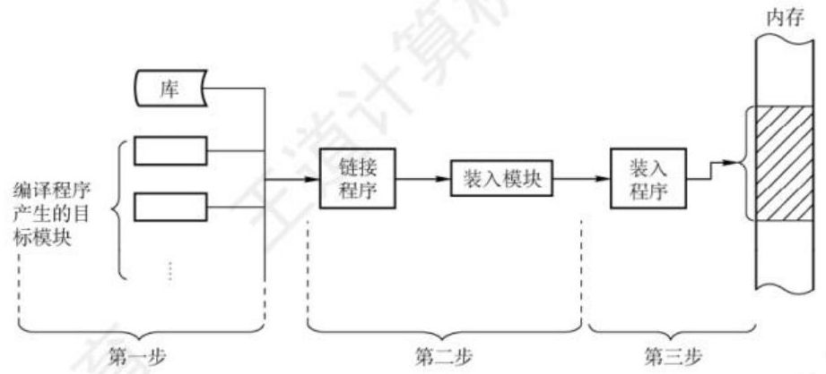
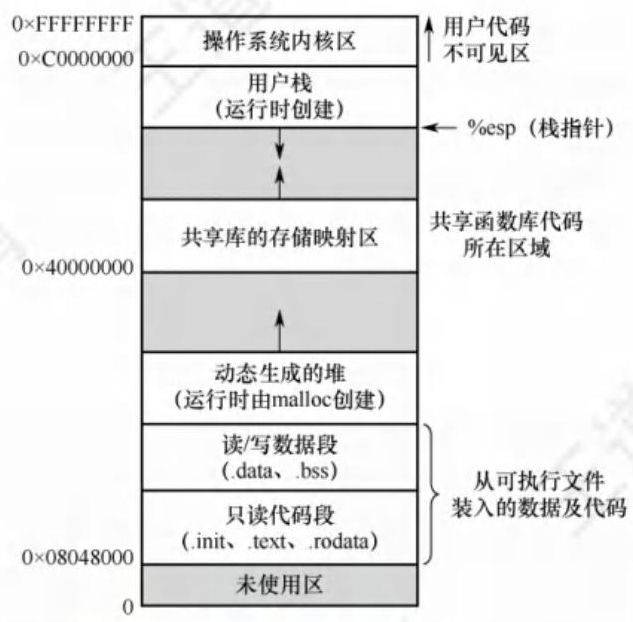
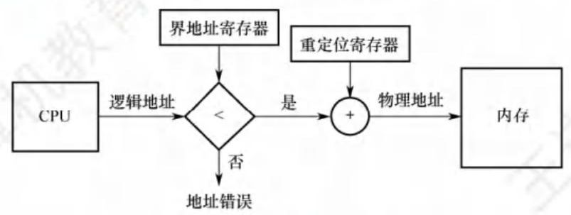
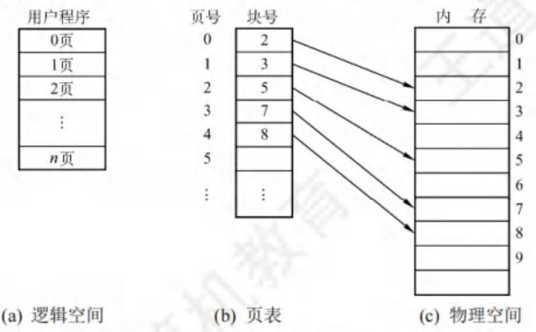
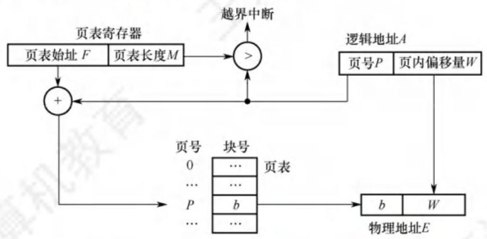
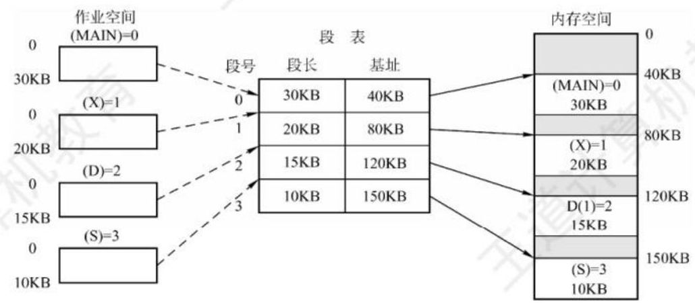
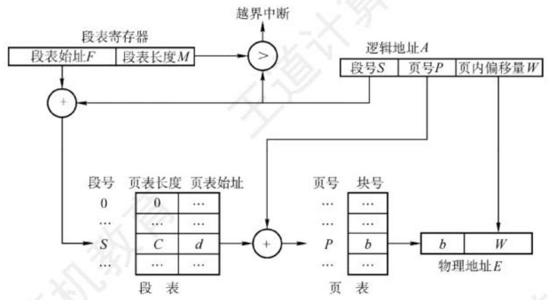

# 3.1 内存管理概念

>【考纲内容】
>
>(一) 内存管理基础
>
>内存管理概念: 逻辑地址与物理地址空间, 地址变换, 内存共享, 内存保护, 内存分配与回收
>
>连续分配管理方式; 页式管理; 段式管理; 段页式管理
>
>(二)虚拟内存管理
>
>虚拟内存基本概念; 请求页式管理; 页框分配; 页置换算法
>
>内存映射文件 (Memory-Mapped Files); 虚拟存储器性能的影响因素及改进方式
>
>【复习提示】
>
>内存管理和进程管理是操作系统的核心内容, 需要重点复习。本章围绕分页机制展开: 通过分页管理方式在物理内存大小的基础上提高内存的利用率, 再进一步引入请求分页管理方式, 实现虚拟内存, 使内存脱离物理大小的限制, 从而提高处理器的利用率。

在学习本节时, 请读者思考以下问题:

1) 为什么要进行内存管理?

2) 多级页表解决了什么问题? 又会带来什么问题?

在学习经典的管理方法前, 同样希望读者先思考, 自己给出一些内存管理的想法, 并在学习过程中和经典方案进行比较。注意本节给出的内存管理是循序渐进的, 后一种方法通常会解决前一种方法的不足。希望读者多多思考, 比较每种方法的异同, 着重掌握页式管理。

## 3.1.1 内存管理的基本原理和要求

内存管理 (Memory Management) 是操作系统设计中最重要和最复杂的内容之一。虽然计算机硬件技术一直在飞速发展, 内存容量也在不断增大, 但仍然不可能将所有用户进程和系统所需要的全部程序与数据放入主存, 因此操作系统必须对内存空间进行合理的划分和有效的动态分配。操作系统对内存的划分和动态分配, 就是内存管理的概念。

有效的内存管理在多道程序设计中非常重要, 它不仅可以方便用户使用存储器、提高内存利用率, 还可以通过虚拟技术从逻辑上扩充存储器。

内存管理的主要功能有:

- 内存空间的分配与回收。由操作系统负责内存空间的分配和管理, 记录内存的空闲空间、 内存的分配情况, 并回收已结束进程所占用的内存空间。

- 地址转换。由于程序的逻辑地址与内存中的物理地址不可能一致, 因此存储管理必须提供地址变换功能, 将逻辑地址转换成相应的物理地址。

- 内存空间的扩充。利用虚拟存储技术从逻辑上扩充内存。

- 内存共享。指允许多个进程访问内存的同一部分。例如, 多个合作进程可能需要访问同一块数据, 因此必须支持对内存共享区域进行受控访问。

- 存储保护。保证各个进程在各自的存储空间内运行, 互不干扰。

在进行具体的内存管理之前, 需要了解进程运行的基本原理和要求。

### 1. 程序的链接与装入

创建进程首先要将程序和数据装入内存。将用户源程序变为可在内存中执行的程序, 通常需要以下几个步骤:

【命题追踪】编译、链接和装入阶段的工作内容(2011)

- 编译。由编译程序将用户源代码编译成若干目标模块。

- 链接。由链接程序将编译后形成的一组目标模块, 以及它们所需的库函数链接在一起, 形成一个完整的装入模块。

- 装入。由装入程序将装入模块装入内存运行。

这三步过程如图 3.1 所示。

图 3.1 将用户程序变为可在内存中执行的程序的步骤

当将一个装入模块装入内存时, 有以下三种装入方式。

#### (1)绝对装入

绝对装入方式只适用于单道程序环境。在编译时, 若知道程序将放到内存的哪个位置, 则编译程序将产生绝对地址的目标代码。装入程序按照装入模块的地址, 将程序和数据装入内存。由于程序中的逻辑地址与实际内存地址完全相同, 因此不需对程序和数据的地址进行修改。

程序中使用的绝对地址, 可在编译或汇编时给出, 也可由程序员直接赋予。而通常情况下在程序中采用的是符号地址, 编译或汇编时再转换为绝对地址。

#### (2)可重定位装入

经过编译、链接后的装入模块的始址 (起始地址) 通常都从 0 开始, 程序中使用的指令和数据地址都是相对于始址的, 此时应采用可重定位装入方式。根据内存的当前情况, 将装入模块装入内存的适当位置。在装入时对目标程序中的相对地址的修改过程称为重定位, 又因为地址转换通常是在进程装入时一次完成的, 所以称为静态重定位, 如图 3.2(a)所示。

当一个作业装入内存时, 必须给它分配要求的全部内存空间, 若没有足够的内存, 则无法装入。作业一旦进入内存, 整个运行期间就不能在内存中移动, 也不能再申请内存空间。

#### (3)动态运行时装入

动态运行时装入也称动态重定位。程序若要在内存中发生移动, 则要采用动态的装入方式。 装入程序将装入模块装入内存后, 并不会立即将装入模块中的相对地址转换为绝对地址, 而是将这种地址转换推迟到程序真正要执行时才进行。因此, 装入内存后的所有地址均为相对地址。这种方式需要一个重定位寄存器 (存放装入模块的起始位置) 的支持, 如图 3.2(b)所示。

动态重定位的优点: 可以将程序分配到不连续的存储区; 在程序运行前只需装入它的部分代码即可投入运行, 然后在程序运行期间, 根据需要动态申请分配内存; 便于程序段的共享。

图 3.2 重定位类型

当对目标模块进行链接时, 根据链接的时间不同, 分为以下三种链接方式。

#### (1)静态链接

在程序运行之前, 先将各目标模块及它们所需的库函数链接成一个完整的装入模块, 以后不再拆开。将几个目标模块装配成一个装入模块时, 需要解决两个问题: ①修改相对地址, 编译后的所有目标模块都是从 0 开始的相对地址, 当链接成一个装入模块时要修改相对地址。②变换外部调用符号, 将每个模块中所用的外部调用符号也都变换为相对地址。

#### (2)装入时动态链接

将用户源程序编译后所得到的一组目标模块, 在装入内存时, 采用边装入边链接的方式。其优点是便于修改和更新, 便于实现对目标模块的共享。

#### (3)运行时动态链接

在程序执行中需要某目标模块时, 才对它进行链接。凡在程序执行中未用到的目标模块, 都不会被调入内存和链接到装入模块上。其优点是能加快程序的装入过程, 还可节省内存空间。

### 2. 逻辑地址与物理地址

【命题追踪】 进程虚拟地址空间的特点(2023)

编译后, 每个目标模块都从 0 号单元开始编址, 这称为该目标模块的相对地址 (或逻辑地址)。 当链接程序将各个模块链接成一个完整的可执行目标程序时, 链接程序顺序依次按各个模块的相对地址构成统一的从 0 号单元开始编址的逻辑地址空间 (或虚拟地址空间), 对于 32 位系统, 逻辑地址空间的范围为 $ 0 \sim {2}^{32} - 1 $ 。进程在运行时,看到和使用的地址都是逻辑地址。用户程序和程序员只需知道逻辑地址, 而内存管理的具体机制则是完全透明的。不同进程可以有相同的逻辑地址, 因为这些相同的逻辑地址可以映射到主存的不同位置。

物理地址空间是指内存中物理单元的集合, 它是地址转换的最终地址, 进程在运行时执行指令和访问数据, 最后都要通过物理地址从主存中存取。当装入程序将可执行代码装入内存时, 必须通过地址转换将逻辑地址转换成物理地址, 这个过程称为地址重定位。

操作系统通过内存管理部件 (MMU) 将进程使用的逻辑地址转换为物理地址。进程使用虚拟内存空间中的地址, 操作系统在相关硬件的协助下, 将它 “转换” 成真正的物理地址。逻辑地址通过页表映射到物理内存, 页表由操作系统维护并被处理器引用。

### 3. 进程的内存映像

不同于存放在硬盘上的可执行程序文件, 当一个程序调入内存运行时, 就构成了进程的内存映像。一个进程的内存映像一般有几个要素:

- 代码段: 即程序的二进制代码, 代码段是只读的, 可以被多个进程共享。

- 数据段: 即程序运行时加工处理的对象, 包括全局变量和静态变量。

- 进程控制块 (PCB): 存放在系统区。操作系统通过 PCB 来控制和管理进程。

- 堆: 用来存放动态分配的变量。通过调用 malloc 函数动态地向高地址分配空间。

- 栈: 用来实现函数调用。从用户空间的最大地址往低地址方向增长。

代码段和数据段在程序调入内存时就指定了大小, 而堆和栈不一样。当调用像 malloc 和 free 这样的 $ \mathrm{C} $ 标准库函数时,堆可以在运行时动态地扩展和收缩。用户栈在程序运行期间也可以动态地扩展和收缩, 每次调用一个函数, 栈就会增长; 从一个函数返回时, 栈就会收缩。

图 3.3 是一个进程在内存中的映像。其中, 共享库用来存放进程用到的共享函数库代码, 如 printf()函数等。在只读代码段中, init 是程序初始化时调用的_init 函数; .text 是用户程序的机器代码; rodata 是只读数据。在读/写数据段中, data 是已初始化的全局变量和静态变量; bss 是未初始化及所有初始化为 0 的全局变量和静态变量。

图 3.3 内存中的一个进程

### 4. 内存保护

【命题追踪】分区分配内存保护的措施 (2009)

确保每个进程都有一个单独的内存空间。内存分配前, 需要保护操作系统不受用户进程的影响, 同时保护用户进程不受其他用户进程的影响。内存保护可采取两种方法:

1) 在 CPU 中设置一对上、下限寄存器, 存放用户进程在主存中的下限和上限地址, 每当 CPU 要访问一个地址时, 分别和两个寄存器的值相比, 判断有无越界。

2) 采用重定位寄存器(也称基地址寄存器)和界地址寄存器(也称限长寄存器)进行越界检查。重定位寄存器中存放的是进程的起始物理地址, 界地址寄存器中存放的是进程的最大逻辑地址。内存管理部件将逻辑地址与界地址寄存器进行比较, 若未发生地址越界, 则加上重定位寄存器的值后映射成物理地址, 再送交内存单元, 如图 3.4 所示。

图 3.4 重定位寄存器和界地址寄存器的硬件支持

实现内存保护需要重定位寄存器和界地址寄存器, 因此要注意两者的区别。重定位寄存器是用来 “加” 的, 逻辑地址加上重定位寄存器中的值就能得到物理地址; 界地址寄存器是用来 “比” 的, 通过比较界地址寄存器中的值与逻辑地址的值来判断是否越界。

加载重定位寄存器和界地址寄存器时必须使用特权指令, 只有操作系统内核才可以加载这两个存储器。这种方案允许操作系统内核修改这两个寄存器的值, 而不允许用户程序修改。

### 5. 内存共享

并不是所有的进程内存空间都适合共享, 只有那些只读的区域才可以共享。可重入代码也称纯代码, 是一种允许多个进程同时访问但不允许被任何进程修改的代码。但在实际执行时, 也可以为每个进程配以局部数据区, 将在执行中可能改变的部分复制到该数据区, 这样, 程序在执行时只需对该私有数据区中的内存进行修改, 并不去改变共享的代码。

下面通过一个例子来说明内存共享的实现方式。考虑一个可以同时容纳 40 个用户的多用户系统,他们同时执行一个文本编辑程序,若该程序有 $ {160}\mathrm{{KB}} $ 代码区和 $ {40}\mathrm{{KB}} $ 数据区,则共需 $ {8000}\mathrm{{KB}} $ 的内存空间来支持 40 个用户。若 $ {160}\mathrm{{KB}} $ 代码是可分享的纯代码,则不论是在分页系统中还是在分段系统中,整个系统只需保留一份副本即可,此时所需的内存空间仅为 $ {40}\mathrm{{KB}} \times {40} + {160}\mathrm{{KB}} = $ $ {1760}\mathrm{{KB}} $ 。对于分页系统,假设页面大小为 $ 4\mathrm{{KB}} $ ,则代码区占用 40 个页面、数据区占用 10 个页面。为实现代码共享, 应在每个进程的页表中都建立 40 个页表项, 它们都指向共享代码区的物理页号。此外, 每个进程还要为自己的数据区建立 10 个页表项, 指向私有数据区的物理页号。 对于分段系统, 由于是以段为分配单位的, 不管该段有多大, 都只需为该段设置一个段表项 (指向共享代码段始址,以及段长 $ {160}\mathrm{{KB}} $ )。由此可见,段的共享非常简单易行。

此外, 在第 2 章中我们介绍过基于共享内存的进程通信, 由操作系统提供同步互斥工具。在本章的后面, 还将介绍一种内存共享的实现一一内存映射文件。

### 6. 内存分配与回收

存储管理方式随着操作系统的发展而发展。在操作系统由单道向多道发展时, 存储管理方式便由单一连续分配发展为固定分区分配。为了能更好地适应不同大小的程序要求, 又从固定分区分配发展到动态分区分配。为了更好地提高内存的利用率, 进而从连续分配方式发展到离散分配方式一一页式存储管理。引入分段存储管理的目的, 主要是满足用户在编程和使用方面的要求, 其中某些要求是其他几种存储管理方式难以满足的。

## 3.1.2 连续分配管理方式

连续分配方式是指为一个用户程序分配一个连续的内存空间, 譬如某用户需要 $ {100}\mathrm{{MB}} $ 的内存空间, 连续分配方式就在内存空间中为用户分配一块连续的 100MB 空间。连续分配方式主要包括单一连续分配、固定分区分配和动态分区分配。

### 1. 单一连续分配

在单一连续分配方式中, 内存被分为系统区和用户区, 系统区仅供操作系统使用, 通常在低地址部分; 用户区内存中仅有一道用户程序, 即用户程序独占整个用户区。

这种方式的优点是简单、无外部碎片; 不需要进行内存保护, 因为内存中永远只有一道程序。 缺点是只能用于单用户、单任务的操作系统中; 有内部碎片; 存储器的利用率极低。

### 2. 固定分区分配

固定分区分配是最简单的一种多道程序存储管理方式, 它将用户内存空间划分为若干固定大小的分区, 每个分区只装入一道作业。当有空闲分区时, 便可再从外存的后备作业队列中选择适当大小的作业装入该分区, 如此循环。在划分分区时有两种不同的方法。

- 分区大小相等。程序太小会造成浪费, 程序太大又无法装入, 缺乏灵活性。

- 分区大小不等。划分为多个较小的分区、适量的中等分区和少量大分区。

为了便于分配和回收, 建立一张分区使用表, 通常按分区大小排队, 各表项包括对应分区的始址、大小及状态 (是否已分配), 如图 3.5 所示。分配内存时, 便检索该表, 以找到一个能满足要求且尚未分配的分区分配给装入程序, 并将对应表项的状态置为 “已分配”; 若找不到这样的分区, 则拒绝分配。回收内存时, 只需将对应表项的状态置为 “未分配” 即可。

<table><thead><tr><th>分区号</th><th>大小/KB</th><th>起址/KB</th><th>状态</th></tr></thead><tr><td>1</td><td>12</td><td>20</td><td>已分配</td></tr><tr><td>2</td><td>32</td><td>32</td><td>已分配</td></tr><tr><td>3</td><td>64</td><td>64</td><td>已分配</td></tr><tr><td>4</td><td>128</td><td>128</td><td>未分配</td></tr></table>

(a) 分区使用表

(b) 存储空间分配情况

图 3.5 固定分区说明表和内存分配情况

这种方式存在两个问题: ①程序太大而放不进任何一个分区; ②当程序小于固定分区大小时, 也要占用一个完整的内存分区, 这样分区内部就存在空间浪费, 这种现象称为内部碎片。固定分区方式无外部碎片, 但不能实现多进程共享一个主存区, 所以存储空间利用率低。

### 3. 动态分区分配

#### (1)动态分区分配的基本原理

动态分区分配也称可变分区分配, 是指在进程装入内存时, 根据进程的实际需要, 动态地为之分配内存, 并使分区的大小正好适合进程的需要。因此, 系统中分区的大小和数量是可变的。

如图 3.6 所示, 系统有 64MB 内存空间, 其中低 8MB 固定分配给操作系统, 其余为用户可用内存。开始时装入前三个进程, 它们分别分配到所需的空间后, 内存仅剩 4MB, 进程 4 无法装入。在某个时刻, 内存中没有一个就绪进程, CPU 出现空闲, 操作系统就换出进程 2, 换入进程 4。由于进程 4 比进程 2 小, 这样在主存中就产生了一个 $ 6\mathrm{{MB}} $ 的内存块。之后 CPU 又出现空闲, 需要换入进程 2, 而主存无法容纳进程 2, 操作系统就换出进程 1 , 换入进程 2 。

图 3.6 动态分区分配

动态分区在开始时是很好的, 但是随着时间的推移, 内存中会产生越来越多的小内存块, 内存的利用率也随之下降。这些小内存块被称为外部碎片, 它存在于所有分区的外部, 与固定分区中的内部碎片正好相对。外部碎片可通过紧凑技术来克服, 即操作系统不时地对进程进行移动和整理。但是, 这需要动态重定位寄存器的支持, 且相对费时。紧凑过程实际上类似于 Windows 系统中的磁盘碎片整理程序, 只不过后者是对外存空间的紧凑。

【命题追踪】动态分区分配的内存回收方法 (2017)

在动态分区分配中, 与固定分区分配类似, 设置一张空闲分区链 (表), 可以按始址排序。 分配内存时, 检索空闲分区链, 找到所需的分区, 若其大小大于请求大小, 则从该分区中按请求大小分割一块空间分配给装入进程 (若剩余部分小到不足以划分, 则不需要分割), 余下部分仍然留在空闲分区链中。回收内存时, 系统根据回收分区的始址, 从空闲分区链中找到相应的插入点, 此时可能出现四种情况: ①回收区与插入点的前一空闲分区相邻, 此时将这两个分区合并, 并修改前一分区表项的大小为两者之和; ②回收区与插入点的后一空闲分区相邻, 此时将这两个分区合并, 并修改后一分区表项的始址和大小; ③回收区同时与插入点的前、后两个分区相邻, 此时将这三个分区合并, 修改前一分区表项的大小为三者之和, 并取消后一分区表项; ④回收区没有相邻的空闲分区, 此时应该为回收区新建一个表项, 填写始址和大小, 并插入空闲分区链。

以上三种内存分区管理方法有一个共同特点, 即用户程序在主存中都是连续存放的。

#### (2)基于顺序搜索的分配算法

将作业装入主存时, 需要按照一定的分配算法从空闲分区链 (表) 中选出一个分区, 以分配给该作业。按分区检索方式, 可分为顺序分配算法和索引分配算法。顺序分配算法是指依次搜索空闲分区链上的空闲分区, 以寻找一个大小满足要求的分区, 顺序分配算法有以下四种。

【命题追踪】各种动态分区分配算法的比较 (2019、2024)
【命题追踪】最佳适应算法的分配过程 (2010)

1) 首次适应 (First Fit) 算法。空闲分区按地址递增的次序排列。每次分配内存时, 顺序查找到第一个能满足大小的空闲分区, 分配给作业。首次适应算法保留了内存高地址部分的大空闲分区, 有利于后续大作业的装入。但它会使内存低地址部分出现许多小碎片, 而每次分配查找时都要经过这些分区, 因此增加了开销。

2) 邻近适应 (Next Fit) 算法。也称循环首次适应算法, 由首次适应算法演变而成。不同之处是, 分配内存时从上次查找结束的位置开始继续查找。邻近适应算法试图解决该问题。 它让内存低、高地址部分的空闲分区以同等概率被分配, 划分为小分区, 导致内存高地址部分没有大空闲分区可用。通常比首次适应算法更差。

3) 最佳适应 (Best Fit) 算法。空闲分区按容量递增的次序排列。每次分配内存时, 顺序查找到第一个能满足大小的空闲分区, 即最小的空闲分区, 分配给作业。最佳适应算法虽然称为最佳, 能更多地留下大空闲分区, 但性能通常很差, 因为每次分配会留下越来越多很小的难以利用的内存块, 进而产生最多的外部碎片。

4) 最坏适应 (Worst Fit) 算法。空闲分区按容量递减的次序排列。每次分配内存时, 顺序查找到第一个能满足要求的之空闲分区, 即最大的空闲分区, 从中分割一部分空间给作业。 与最佳适应算法相反, 最坏适应算法选择最大的空闲分区, 这看起来最不容易产生碎片, 但是把最大的空闲分区划分开, 会很快导致没有大空闲分区可用, 因此性能也很差。

综合来看, 首次适应算法的开销小, 性能最好, 回收分区也不需要对空闲分区重新排序。

#### (3)基于索引搜索的分配算法

当系统很大时, 空闲分区链可能很长, 此时采用顺序分配算法可能很慢。因此, 在大、中型系统中往往采用索引分配算法。索引分配算法的思想是, 根据其大小对空闲分区分类, 对于每类 (大小相同) 空闲分区, 单独设立一个空闲分区链, 并设置一张索引表来管理这些空闲分区链。 当为进程分配空间时, 在索引表中查找所需空间大小对应的表项, 并从中得到对应的空闲分区链的头指针, 从而获得一个空闲分区。索引分配算法有以下三种。

【命题追踪】伙伴关系的概念 (2024)

1) 快速适应算法。空闲分区的分类根据进程常用的空间大小进行划分。分配过程分为两步: ①首先根据进程的长度, 在索引表中找到能容纳它的最小空闲分区链表; ②然后从链表中取出第一块进行分配。优点是查找效率高、不产生内部碎片; 缺点是回收分区时, 需要有效地合并分区, 算法比较复杂, 系统开销较大。

2) 伙伴系统。规定所有分区的大小均为 2 的 $ k $ 次幂 ( $ k $ 为正整数)。当需要为进程分配大小为 $ n $ 的分区时 $ \left( {{2}^{i - 1} < n \leq {2}^{i}}\right) $ ,在大小为 $ {2}^{i} $ 的空闲分区链中查找。若找到,则将该空闲分区分配给进程。否则,表示大小为 $ {2}^{i} $ 的空闲分区已耗尽,需要在大小为 $ {2}^{i + 1} $ 的空闲分区链中继续查找。若存在大小为 $ {2}^{i + 1} $ 的空闲分区,则将其等分为两个分区,这两个分区称为一对伙伴,其中一个用于分配,而将另一个加入大小为 $ {2}^{i} $ 的空闲分区链。若不存在,则继续查找, 直至找到为止。回收时, 也可能需要对伙伴分区进行合并。

3) 哈希算法。根据空闲分区链表的分布规律, 建立哈希函数, 构建一张以空闲分区大小为关键字的哈希表, 每个表项记录一个对应空闲分区链的头指针。分配时, 根据所需分区大小, 通过哈希函数计算得到哈希表中的位置, 从中得到相应的空闲分区链表。

在连续分配方式中, 我们发现, 即使内存有超过 1GB 的空闲空间, 但若没有连续的 1GB 空间, 则需要 1GB 空间的作业仍然是无法运行的; 但若采用非连续分配方式, 则作业所要求的 1GB 内存空间可以分散地分配在内存的各个区域, 当然, 这也需要额外的空间去存储它们 (分散区域) 的索引, 使得非连续分配方式的存储密度低于连续分配方式。非连续分配方式根据分区的大小是否固定, 分为分页存储管理和分段存储管理。在分页存储管理中, 又根据运行作业时是否要将作业的所有页面都装入内存才能运行, 分为基本分页存储管理和请求分页存储管理。

## 3.1.3 基本分页存储管理

> 本章后面的内容与《计算机组成原理考研复习指导》一书的 3.6 节高度相关, 建议结合复习。

固定分区会产生内部碎片, 动态分区会产生外部碎片, 这两种技术对内存的利用率都比较低。 我们希望内存的使用能尽量避免碎片的产生, 这就引入了分页的思想: 将内存空间分为若干固定大小 (如 $ 4\mathrm{{KB}} $ ) 的分区,称为页框、页帧或物理块。进程的逻辑地址空间也分为与块大小相等的若干区域, 称为页或页面。操作系统以页框为单位为各个进程分配内存空间。

从形式上看, 分页的方法像是分区相等的固定分区技术, 分页管理不产生外部碎片。但它又有本质的不同点: 块的大小相对分区要小很多, 而且进程也按照块进行划分, 进程运行时按块申请主存可用空间并执行。这样, 进程只会在为最后一个不完整的块申请一个主存块空间时, 才产生主存碎片, 所以尽管会产生内部碎片, 但这种碎片相对于进程来说也是很小的, 每个进程平均只产生半个块大小的内部碎片 (也称页内碎片)。

### 1. 分页存储的几个基本概念

#### (1)页面和页面大小

进程的逻辑地址空间中的每个页面有一个编号, 称为页号, 从 0 开始; 内存空间中的每个页框也有一个编号, 称为页框号 (或物理块号), 也从 0 开始。进程在执行时需要申请内存空间, 即要为每个页面分配内存中的可用页框, 这就产生了页号和页框号的一一对应。

为方便地址转换, 页面大小应是 2 的整数次幂。同时页面大小应该适中, 页面太小会使进程的页面数过多, 这样页表就会过长, 占用大量内存, 而且也会增加硬件地址转换的开销, 降低页面换入/换出的效率; 页面过大又会使页内碎片增多, 降低内存的利用率。

#### (2)地址结构

【命题追踪】 分页系统的逻辑地址结构(2009、2010、2013、2015、2017)

某个分页存储管理的逻辑地址结构如图 3.7 所示。

<table><tr><td>31....12</td><td>11....0</td></tr><tr><td>页号 P</td><td>页内偏移量 W</td></tr></table>

图 3.7 某个分页存储管理的逻辑地址结构

地址结构包含两部分: 前一部分为页号 $ P $ ,后一部分为页内偏移量 $ W $ 。地址长度为 32 位, 其中 $ 0 \sim {11} $ 位为页内地址,即每页大小为 $ {2}^{12}\mathrm{\;B};{12} \sim {31} $ 位为页号,即最多允许 $ {2}^{20} $ 页。

注意, 地址结构决定了虚拟内存的寻址空间有多大。在实际问题中, 页号、页内偏移、逻辑地址可能是用十进制数给出的, 若题目用二进制数给出时, 读者要会转换。

#### (3)页表

为了便于找到进程的每个页面在内存中存放的位置, 系统为每个进程建立一张页面映射表, 简称页表。进程的每个页面对应一个页表项, 每个页表项由页号和块号组成, 它记录了页面在内存中对应的物理块号, 如图 3.8 所示。进程执行时, 通过查找页表, 即可找到每页在内存中的物理块号。可见, 页表的作用是实现从页号到物理块号的地址映射。

图 3.8 页表的作用

### 2. 基本地址变换机构

地址变换机构的任务是将逻辑地址转换为内存中的物理地址。地址变换是借助于页表实现的。图 3.9 给出了分页存储管理系统中的地址变换机构。

图 3.9 分页存储管理系统中的地址变换机构

>注 意
>
>在页表中，由于页表项连续存放，因此页号可以是隐含的，不占用存储空间。

为了提高地址变换的速度,在系统中设置一个页表寄存器 (PTR),存放页表在内存的始址 $ F $ 和页表长度 $ M $ 。由于寄存器的造价昂贵,因此在单 CPU 系统中只设置一个页表寄存器。平时, 进程未执行时, 页表的始址和页表长度存放在本进程的 PCB 中, 当进程被调度执行时, 才将页表始址和页表长度装入页表寄存器中。设页面大小为 $ L $ ,逻辑地址 $ A $ 到物理地址 $ E $ 的变换过程如下 (假设逻辑地址、页号、每页的长度都是十进制数):

【命题追踪】 页式系统的地址变换过程 (2013、2021、2024)

【命题追踪】 页表项地址的计算与分析 (2024)

① 根据逻辑地址计算出页号 $ P = A/L $ 、页内偏移量 $ W = A\% L $ 。

② 判断页号是否越界,若页号 $ P \geq $ 页表长度 $ M $ ,则产生越界中断,否则继续执行。

③ 在页表中查询页号对应的页表项,确定页面存放的物理块号。页号 $ P $ 对应的页表项地址 $ = $ 页表始址 $ F + $ 页号 $ P \times $ 页表项长度,取出该页表项内容 $ b $ ,即为物理块号。

④ 计算物理地址 $ E = b \times L + W $ ,用物理地址 $ E $ 去访存。注意,物理地址 $ = $ 页面在内存中的始址+页内偏移量,页面在内存中的始址 $ = $ 块号 $ \times $ 块大小 (页面大小)。

以上整个地址变换过程均是由硬件自动完成的。例如,若页面大小 $ L $ 为 $ 1\mathrm{{KB}} $ ,页号 2 对应的物理块为 $ b = 8 $ ,计算逻辑地址 $ A = {2500} $ 的物理地址 $ E $ 的过程如下: $ P = {2500}/1\mathrm{\;K} = 2, W = {2500}\% 1\mathrm{\;K} = $ 452,查找得到页号 2 对应的物理块的块号为 $ 8, E = 8 \times {1024} + {452} = {8644} $ 。

计算条件用十进制数和用二进制数给出, 过程会稍有不同。页式管理只需给出一个整数就能确定对应的物理地址,因为页面大小 $ L $ 是固定的。因此,页式管理中地址空间是一维的。

页表项的大小不是随意规定的, 而是有所约束的。如何确定页表项的大小?

页表项的作用是找到该页在内存中的位置。以 32 位逻辑地址空间、字节编址单位、一页 $ 4\mathrm{{KB}} $ 为例,地址空间内一共有 $ {2}^{32}\mathrm{\;B}/4\mathrm{{KB}} = {2}^{20} $ 页,因此需要 $ {\log }_{2}{2}^{20} = {20} $ 位才能保证表示范围能容纳所有页面,又因为内存以字节作为编址单位,即页表项的大小 $ \geq \lceil {20}/8\rceil = 3\mathrm{\;B} $ 。所以在这个条件下, 为了保证页表项能够指向所有页面, 页表项的大小应大于或等于 $ 3\mathrm{\;B} $ 。当然,也可以选择更大的页表项, 让一个页面能够正好容纳整数个页表项, 或便于增加一些其他信息。

下面讨论分页管理方式存在的两个主要问题: ①每次访存操作都需要进行逻辑地址到物理地址的转换, 地址转换过程必须足够快, 否则访存速度会降低; ②每个进程引入页表, 用于存储映射机制, 页表不能太大, 否则内存利用率会降低。

### 3. 具有快表的地址变换机构

由上面介绍的地址变换过程可知, 若页表全部放在内存中, 则存取一个数据或一条指令至少要访问两次内存: 第一次是访问页表, 确定所存取的数据或指令的物理地址; 第二次是根据该地址存取数据或指令。显然, 这种方法比通常执行指令的速度慢了一半。

为此, 在地址变换机构中增设一个具有并行查找能力的高速缓冲存储器一一快表 (TLB), 也称相联存储器, 用来存放当前访问的若干页表项, 以加速地址变换的过程。与此对应, 主存中的页表常称为慢表。具有快表的地址变换机构如图 3.10 所示。

图 3.10 具有快表的地址变换机构

【命题追踪】具有快表的地址变换的性能分析 (2009)

在具有快表的分页机制中, 地址的变换过程如下:

① CPU 给出逻辑地址后, 由硬件进行地址转换, 将页号与快表中的所有页号进行比较。

② 若找到匹配的页号, 说明要访问的页表项在快表中有副本, 则直接从中取出该页对应的页框号, 与页内偏移量拼接形成物理地址。这样, 存取数据仅一次访存即可实现。

③ 若未找到匹配的页号, 则需要访问主存中的页表, 读出页表项后, 应同时将其存入快表, 以便后面可能的再次访问。若快表已满, 则须按照特定的算法淘汰一个旧页表项。

一般快表的命中率可达 $ {90}\% $ 以上,这样分页带来的速度损失就可降低至 $ {10}\% $ 以下。快表的有效性基于著名的局部性原理, 后面讲解虚拟内存时将具体讨论它。

### 4. 两级页表

引入分页管理后, 进程在执行时不需要将所有页调入内存页框, 而只需将保存有映射关系的页表调入内存。但仍需考虑页表的大小。以 32 位逻辑地址空间、页面大小 $ 4\mathrm{{KB}} $ 、页表项大小 $ 4\mathrm{\;B} $ 为例: 页内偏移为 $ {\log }_{2}4\mathrm{\;K} = {12} $ 位,页号部分为 20 位,则每个进程页表中的页表项数可达 $ {2}^{20} $ 之多, 仅页表就要占用 $ {2}^{20} \times 4\mathrm{\;B}/4\mathrm{{KB}} = 1\mathrm{\;K} $ 个页,而且还要求是连续的。显然这是不切实际的。

【命题追踪】多级页表的特点和优点 (2014)

解决上述问题的方法有两种: ①对于页表所需的内存空间, 采用离散分配方式, 用一张索引表来记录各个页表的存放位置, 这就解决了页表占用连续内存空间的问题; ②只将当前需要的部分页表项调入内存, 其余的页表项仍驻留磁盘, 需要时再调入 (虚拟内存的思想), 这就解决了页表占用内存过多的问题。读者也许发现这个方案就和当初引进页表机制的思路一模一样, 实际上就是为离散分配的页表再建立一张页表, 称为外层页表 (或页目录)。仍以上面的条件为例, 当采用两级分页时,对页表再进行分页,则外层页表需要 $ 1\mathrm{\;K} $ 个页表项,刚好占用 $ 4\mathrm{{KB}} $ 的内存空间, 使得外层页表的大小正好等于一页, 这样就得到了逻辑地址空间的格式, 如图 3.11 所示。

<table><thead><tr><th>一级页号或页目录号10位</th><th>二级页号或页号10位</th><th>页内偏移12位</th></tr></thead></table>

图 3.11 逻辑地址空间的格式

命题追踪 两级页表的逻辑地址结构及相关分析(2010、2013、2015、2017—2019)

两级页表是在普通页表结构上再加一层页表, 其结构如图 3.12 所示。

图 3.12 两级页表结构示意图

在页表的每个表项中, 存放的是进程的某页对应的物理块号, 如 0 号页存放在 1 号物理块中, 1 号页存放在 5 号物理块中。在外层页表的每个表项中, 存放的是某个页表分页的始址, 如 0 号页表存放在 3 号物理块中。可以利用外层页表和页表来实现进程从逻辑地址到物理地址的变换。

【命题追踪】 二级页表的页表基址寄存器中的内容(2018、2021)

【命题追踪】 二级页表中的地址变换过程 (2015、2017)

为了方便实现地址变换, 需要在系统中增设一个外层页表寄存器 (也称页目录基址寄存器), 用于存放页目录始址。将逻辑地址中的页目录号作为页目录的索引, 从中找到对应页表的始址; 再用二级页号作为页表分页的索引, 从中找到对应的页表项; 将页表项中的物理块号和页内偏移拼接, 即为物理地址, 再用该地址访问内存单元。共进行了 3 次访存。

对于更大的逻辑地址空间,以 64 位为例,若采用两级分页,则页面大小为 $ 4\mathrm{{KB}} $ ,页表项大小为 $ 4\mathrm{\;B} $ ; 若按物理块大小划分页表,则有 42 位用于外层页号,此时外层页表有 $ {4096}\mathrm{G} $ 个页表项, 需占用 $ {16384}\mathrm{\;{GB}} $ 的连续内存空间,显然这是无法接受的,因此必须采用多级页表,再对外层页表分页。建立多级页表的目的在于建立索引, 以免浪费内存空间去存储无用的页表项。

## 3.1.4 基本分段存储管理

分页管理方式是从计算机的角度考虑设计的, 目的是提高内存的利用率, 提升计算机的性能。 分页通过硬件机制实现, 对用户完全透明。分段管理方式的提出则考虑了用户和程序员, 以满足方便编程、信息保护和共享、动态增长及动态链接等多方面的需要。

### 1. 分段

分段系统将用户进程的逻辑地址空间划分为大小不等的段。例如, 用户进程由主程序段、两个子程序段、栈段和数据段组成, 于是可以将这个进程划分为 5 段, 每段从 0 开始编址, 并分配一段连续的地址空间 (段内要求连续, 段间不要求连续, 进程的地址空间是二维的)。

【命题追踪】分段系统的逻辑地址结构分析 (2009)

分段存储管理的逻辑地址结构由段号 $ S $ 与段内偏移量 $ W $ 两部分组成。在图 3.13 中,段号为 16 位,段内偏移量为 16 位,因此一个进程最多有 $ {2}^{16} = {65536} $ 段,最大段长为 $ {64}\mathrm{{KB}} $ 。

<table><thead><tr><th>31...16</th><th>15...0</th></tr></thead><tr><td>段号 S</td><td>段内偏移量 W</td></tr></table>

图 3.13 分段系统中的逻辑地址结构

在页式系统中, 逻辑地址的页号和页内偏移量对用户是透明的, 但在分段系统中, 段号和段内偏移量必须由用户显式提供, 在高级程序设计语言中, 这个工作由编译程序完成。

### 2. 段表

每个进程都有一张逻辑空间与内存空间映射的段表, 进程的每个段对应一个段表项, 段表项记录了该段在内存中的始址和段的长度。段表的内容如图 3.14 所示。

<table><thead><tr><th>段号</th><th>段长</th><th>本段在主存的起始地址</th></tr></thead></table>

图 3.14 段表的内容

配置段表后, 执行中的进程可以通过查找段表, 找到每段所对应的内存区。可见, 段表用于实现从逻辑段到物理内存区的映射, 如图 3.15 所示。

图 3.15 利用段表实现物理内存区映射

### 3. 地址变换机构

分段系统的地址变换过程如图 3.16 所示。为了实现进程从逻辑地址到物理地址的变换功能, 在系统中设置了一个段表寄存器,用于存放段表始址 $ F $ 和段表长度 $ M $ 。从逻辑地址 $ A $ 到物理地址 $ E $ 之间的地址变换过程如下:

图 3.16 分段系统的地址变换过程

【命题追踪】段式系统的地址变换过程 (2016)

① 从逻辑地址 $ \mathrm{A} $ 中取出前几位为段号 $ S $ ,后几位为段内偏移量 $ W $ 。

② 判断段号是否越界，若段号 $ S \geq $ 段表长度 $ M $ ，则产生越界中断，否则继续执行。

③ 在段表中查询段号对应的段表项,段号 $ S $ 对应的段表项地址 $ = $ 段表始址 $ F + $ 段号 $ S \times $ 段表项长度。取出段表项中该段的段长 $ C $ ,若 $ W \geq C $ ,则产生越界中断,否则继续执行。

④ 取出段表项中该段的始址 $ b $ ,计算物理地址 $ E = b + W $ ,用物理地址 $ E $ 去访存。

### 4. 分页和分段的对比

分页和分段有许多相似之处, 两者都是非连续分配方式, 都要通过地址映射机构实现地址变换。但是, 在概念上两者完全不同, 主要表现在以下三个方面:

1) 页是信息的物理单位, 分页的主要目的是提高内存利用率, 分页完全是系统的行为, 对用户是不可见的。段是信息的逻辑单位, 分段的主要目的是更好地满足用户需求, 用户按照逻辑关系将程序划分为若干段, 分段对用户是可见的。

2) 页的大小固定且由系统决定。段的长度不固定, 具体取决于用户所编写的程序。

3) 分页管理的地址空间是一维的。段式管理不能通过给出一个整数便确定对应的物理地址, 因为每段的长度是不固定的, 无法通过除法得出段号, 无法通过求余得出段内偏移, 所以一定要显式给出段号和段内偏移, 因此分段管理的地址空间是二维的。

### 5. 段的共享与保护

【命题追踪】页、段共享的原理和特点 (2019、2023)

在分页系统中,虽然也能实现共享,但远不如分段系统来得方便。若被共享的代码占 $ N $ 个页框,则每个进程的页表中都要建立 $ N $ 个页表项,指向被共享的 $ N $ 个页框。

在分段系统中, 不管该段有多大, 都只需为该段设置一个段表项, 因此非常容易实现共享。只需在每个进程的段表中设置一个段表项, 指向被共享的同一个物理段。不能被任何进程修改的代码称为可重入代码或纯代码 (不属于临界资源), 它是一种允许多个进程同时访问的代码。为了防止程序在执行时修改共享代码, 在每个进程中都必须配以局部数据区, 将在执行过程中可能改变的部分复制到数据区, 这样, 进程就可对该数据区中的内容进行修改。

与分页管理类似, 分段管理的保护方法主要有两种: 一种是存取控制保护, 另一种是地址越界保护。地址越界保护将段表寄存器中的段表长度与逻辑地址中的段号比较, 若段号大于段表长度, 则产生越界中断; 再将段表项中的段长和逻辑地址中的段内偏移进行比较, 若段内偏移大于段长, 也会产生越界中断。分页管理只需要判断页号是否越界, 页内偏移是不可能越界的。

## 3.1.5 段页式存储管理

分页存储管理能有效地提高内存利用率, 而分段存储管理能反映程序的逻辑结构并有利于段的共享和保护。将这两种存储管理方法结合起来, 便形成了段页式存储管理方式。

在段页式系统中, 进程的地址空间首先被分成若干逻辑段, 每段都有自己的段号, 然后将每段分成若干大小固定的页。对内存空间的管理仍然和分页存储管理一样, 将其分成若干和页面大小相同的存储块, 对内存的分配以存储块为单位, 如图 3.17 所示。

图 3.17 段页式管理方式

在段页式系统中, 进程的逻辑地址分为三部分: 段号、页号和页内偏移量, 如图 3.18 所示。

<table><thead><tr><th>段号 S</th><th>页号 P </th><th>页内偏移量 W</th></tr></thead></table>

图 3.18 段页式系统的逻辑地址结构

为了实现地址变换, 系统为每个进程建立一张段表, 每个段对应一个段表项, 每个段表项至少包括段号、页表长度和页表始址; 每个段有一张页表, 每个页表项至少包括页号和块号。此外, 系统中还应有一个段表寄存器, 指出进程的段表始址和段表长度 (段表寄存器和页表寄存器的作用都有两个, 一是在段表或页表中寻址, 二是判断是否越界)。

---

注 意

在段页式存储管理中, 每个进程的段表只有一个, 而页表可能有多个。

---

在进行地址变换时, 首先通过段表查到页表始址, 然后通过页表找到物理块号, 最后形成物理地址。如图 3.19 所示, 进行一次访问实际需要三次访问主存, 这里同样可以使用快表来加快查找速度, 其关键字由段号、页号组成, 值是对应的物理块号和保护码。

图 3.19 段页式系统的地址变换机构

结合上面对段式和页式管理地址空间的分析, 得出结论: 段页式管理的地址空间是二维的。

## 3.1.6 本节小结

本节开头提出的问题的参考答案如下。

### 1. 为什么要进行内存管理?

在单道系统阶段, 一个系统在一个时间段内只执行一个程序, 内存的分配极其简单, 即仅分配给当前运行的进程。引入多道程序后, 进程之间共享的不仅仅是处理机, 还有主存储器。然而, 共享主存会形成一些特殊的挑战。若不对内存进行管理, 则容易导致内存数据的混乱, 以至于影响进程的并发执行。因此, 为了更好地支持多道程序并发执行, 必须进行内存管理。

### 2. 多级页表解决了什么问题? 又会带来什么问题?

多级页表解决了当逻辑地址空间过大时, 页表的长度会大大增加的问题。而采用多级页表时, 一次访盘需要多次访问内存甚至磁盘, 会大大增加一次访存的时间。

无论是段式管理、页式管理还是段页式管理, 读者都只需要掌握下面三个关键问题: ①逻辑地址结构, ②页 (段) 表项结构, ③寻址过程。搞清楚这三个问题, 就相当于搞清楚了上面几种存储管理方式。再次提醒读者区分逻辑地址结构和表项结构。

## 习题

2、5、6、8、12、14、20、23、24、26、28、37、38、39、41、49、55、58、59、61、61、62、64、65、67、71

所有应用题
